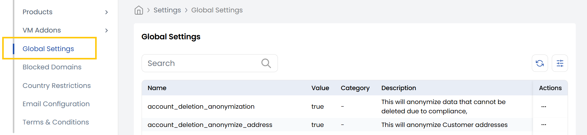

## Global Settings

The **Global Settings** tab provides a centralized place to view and manage system-wide configurations. These settings control key behaviors such as account deletion policies, data anonymization, default network creation, VM name generation, and billing options. Admins can use this tab to ensure the platform operates according to organizational and compliance requirements.

-----

-----

## Conclusion

The **Global Settings** tab is essential for configuring the foundational rules of your Stack Console platform, helping maintain consistency, compliance, and operational efficiency across all user activities.
