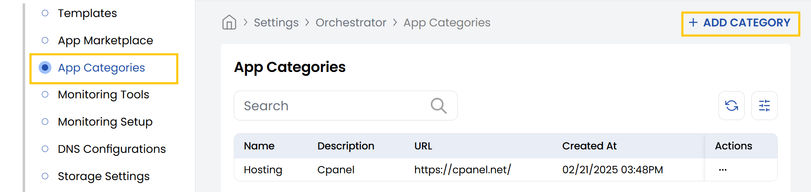
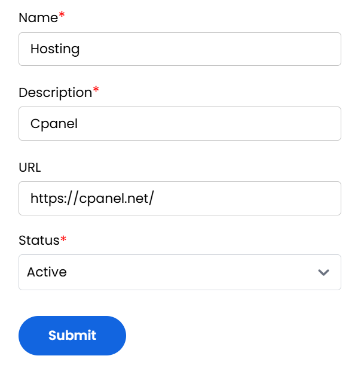

## App Categories in Stack Console

The **App Categories** help organize marketplace apps for better discoverability. Common categories include Hosting, CMS, VPN, Security, and more.

- From the left-hand side of the page under the **Orchestrator** section, click on **App Categories** to view the list of app categories.
- To create a new app category, click on **Add Category**.

- Provide a name and add a brief description of the category. Enter the site URL for the category application.
- You can create category like Hosting, Web server, CMS, VPN, Database, eCommerce, Monitoring, Productivity, Communications, Security, Control Panels as per requirement.
- Select the status from Active or Inactive and click on **Submit**. 

