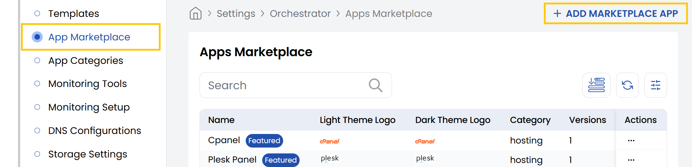
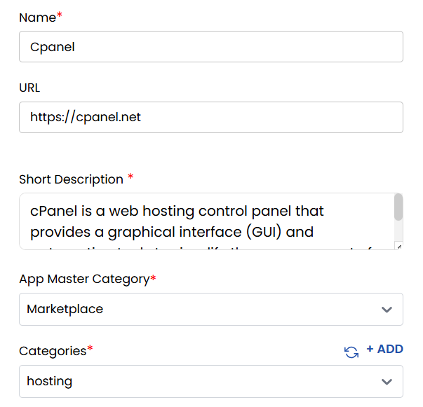
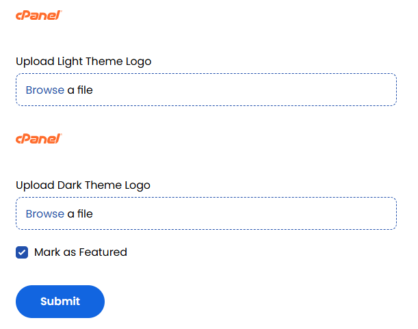
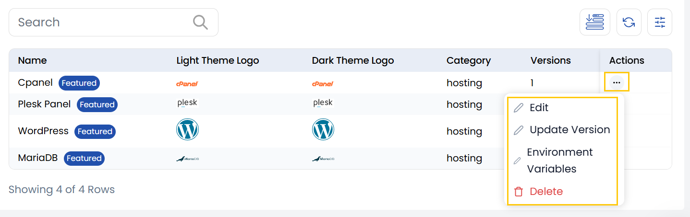
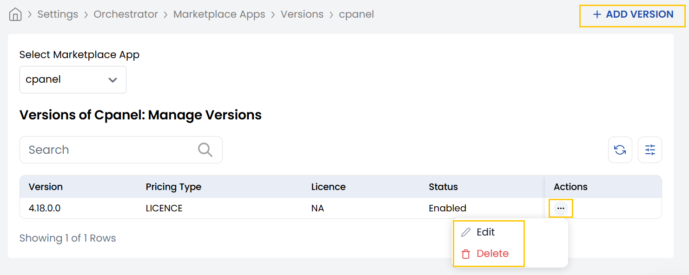
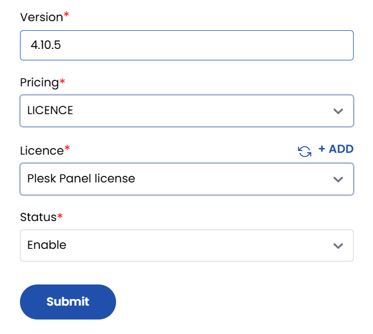
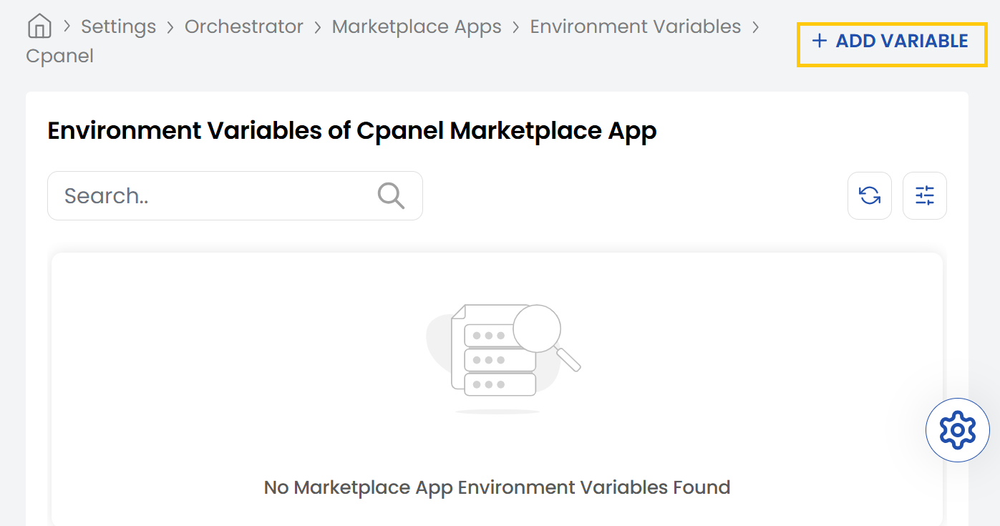
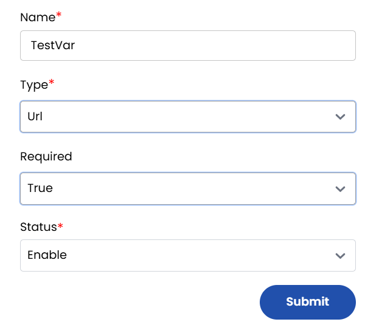

## App Marketplace in Stack Console

The **Marketplace Apps** are deployable applications that users can discover, install, and manage. These apps can be categorized, versioned, and configured using environment variables.

- From the left-hand side of the page under the **Orchestrator** section, click on **App Marketplace** to view the list of marketplace apps.
- To create a new marketplace app, click on **Add Marketplace App**.

- Provide a name and add a brief description of the marketplace app. Enter the site URL for the marketplace app.
- You can create market place app like cPanel, Plesk, WordPress, CloudPanel, Zabbix, Odoo, MariaDB, FreePBX, NextcloudAIO, GitLab.
- Select master category (community, marketplace, etc.) and then select the app category for marketplace.

- You can upload the theme logo for light and dark themes. 
- Toggle **Mark as Featured** if the app should be promoted on the dashboard. Click **Submit** to add the new app to the marketplace.

- You can also update the app, update its version, update environment variables, or delete it if needed. Click on the three dots next to the marketplace app to modify.

### Update Version 
- To update version, click on the three dots next to the marketplace app to modify and select **Update Version**.
- You can edit and delete the existing versions by clicking on the three dots next to it.
- Click on **Add Version** to add new version to the versions to the marketplace app.

- Enter the name of the version, select the pricing as free or license and choose the license for this version. 
- Choose status as Enable/Disable and click on **Submit**.

### Update Environment Variables of Marketplace App

- To update environment variables of marketplace app, click on the three dots next to the marketplace app to modify and select **Environment Variables**.
- Click on **Add Variable** to add new variable to the marketplace app.

- Enter the name and type of variable. You can choose types like URL, Text, Password, etc.
- Select required as True or False. Choose the status as Enable/Disable and click on Submit.

