## Cloud Provider Setup for OpenStack in Stack Console

The **Cloud Provider Setup** tab allows administrators to add, configure, or modify OpenStack cloud provider connections, enabling seamless provisioning and orchestration.

### Pre-requisites for OpenStack in Stack Console

Before configuring the OpenStack Cloud Provider in Stack Console, ensure the following details are available and correct:

- **API Endpoint:** This is the identity service endpoint. Make sure from CMP server to the OpenStack setup access is available.

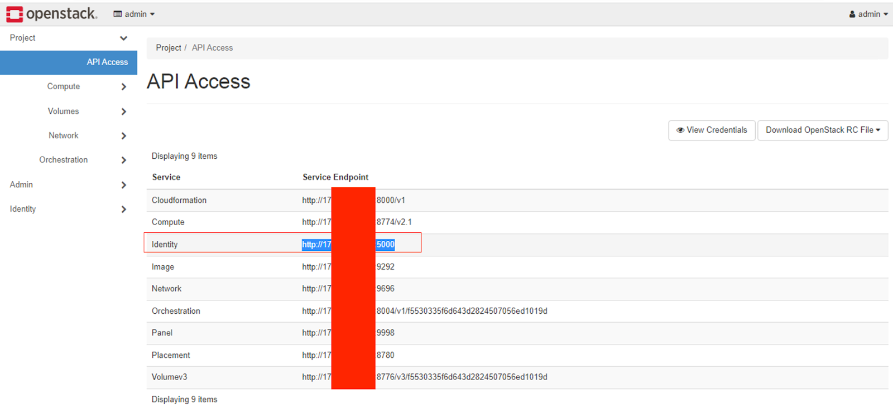

- **API Key / User ID:** This will be the admin user ID Or the user we will be creating/created with an admin role for the CMP.

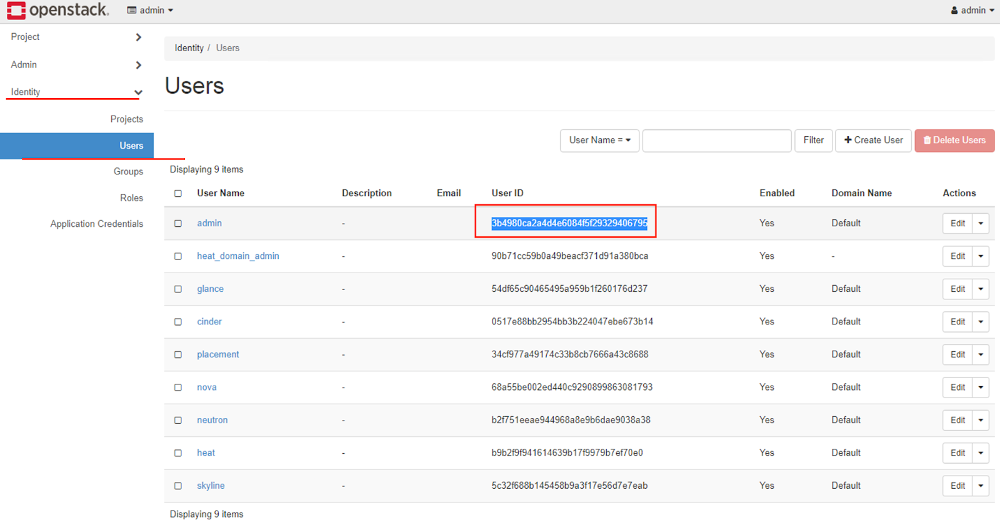

- **Project ID:** To collect the project ID, you need to log in to the admin project and, from identity, users, and overview, collect the primary project ID. 
If the primary project is null, you need to edit the project and assign the primary project to this admin user.

:::important

If any update is done for the admin user at the openstack or VHI level, then this id must be cross-checked; otherwise, it will throw an error at cmp.

:::

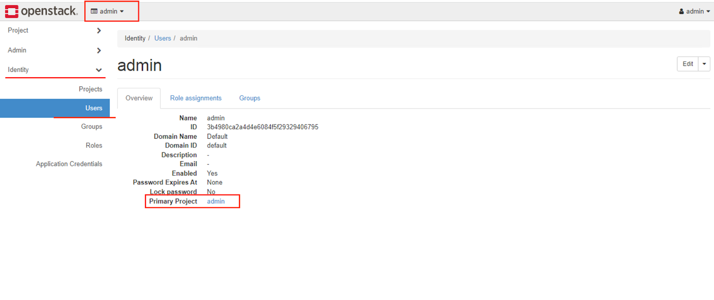

- **Domain ID:** Domain ID under which we are registering new users or creating resources for users.

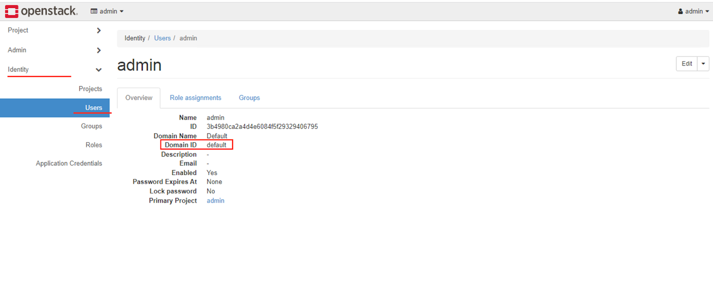

- **External Network ID:** Public Network ID we use if the user opts for a public IP address.

:::important

If any update is done for the network at the openstack or VHI level, then this id must be cross-checked; otherwise, it will throw an error at cmp.

:::

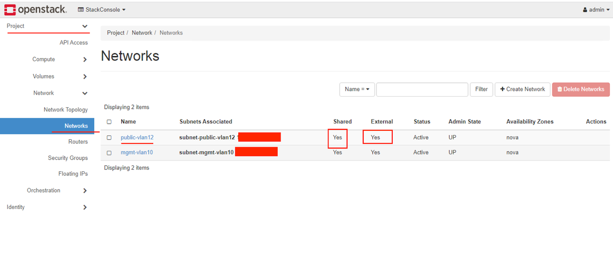

- **Default Storage Policy UUID:** Storage policy UUID used for VM volumes (e.g., SSD, NVMe).
- **OpenStack Project User Role:** Default role (e.g., `member`) assigned when CMP creates users in OpenStack.
  - Role is **case-sensitive**.
  - Virtuozzo OpenStack may require multiple roles.

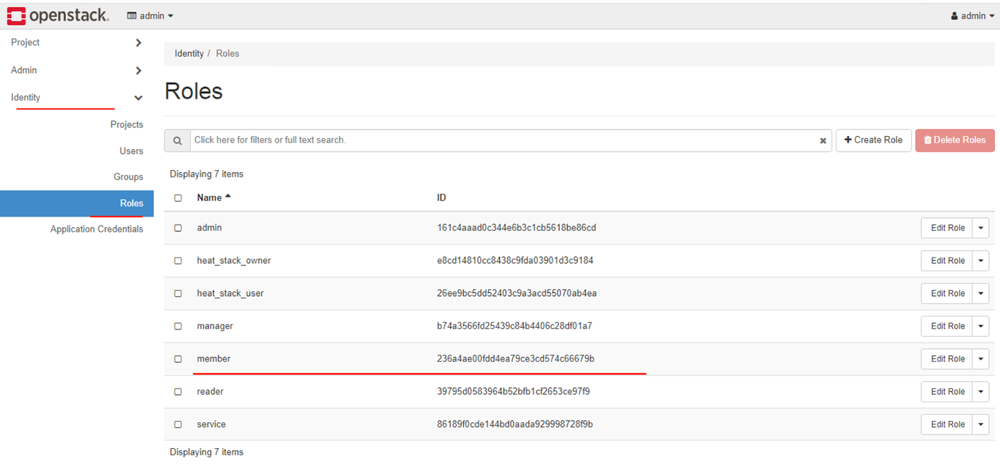

- **One GB Multiplier:** Defines 1 GB as `1000MB` or `1024MB`, used in storage/flavor configuration.

### Setup a Cloud Provider Setup for OpenStack

- From the **Orchestrator** menu, select **Cloud Provider Setup**. Click on **Add Setup** to begin creating a new configuration.

:::note
If this has already been configured by the Stack Console team, it is recommended to only **edit** existing entries.
:::

- Click the three-dot menu next to a setup and select **Edit** to modify.

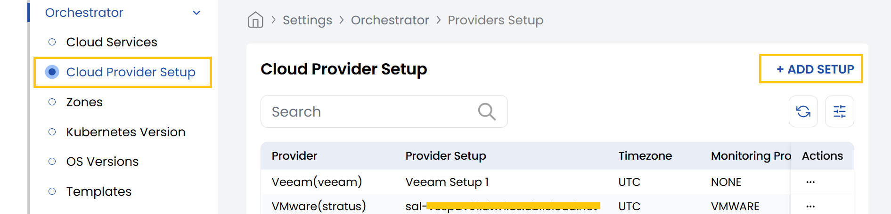

- **Cloud Provider:** Select **OpenStack (alto)**.
- **Setup Name:** Enter a name (e.g., `OpenStack Setup 01`).
- **Services:** Select all required services like VM, Network, Load Balancer, etc.
- **Monitoring Provider:** Choose from available integrations (e.g., Zabbix, Prometheus).
- **Timezone:** Set the correct timezone for OpenStack region (e.g., `Asia/Kolkata`).
- **API Endpoint:** Keystone URL (e.g., `https://keystone.example.com/v3`).

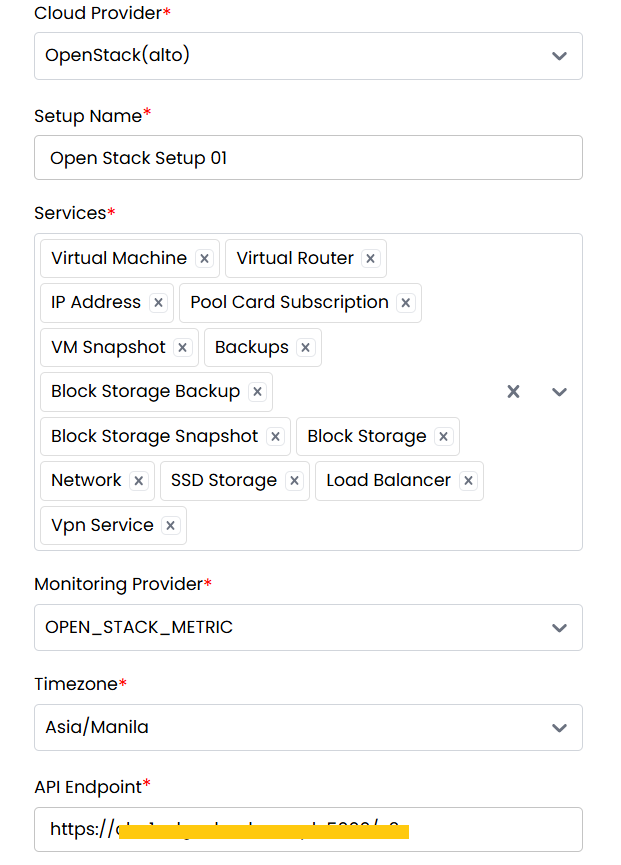

- **API Key:** Admin user ID.
- **API Secret:** Admin user password.
- **API Version:** Specify OpenStack API version (e.g., `v3`).
- **Status:** Set to **Active** to enable this setup.
- **External Network Display Name:** Human-readable name for public network.
- **Project ID:** Primary OpenStack project ID for the admin user.
- **Default Security Group ID:** ID of the default security group.
- **Console Proxy URL:** URL for accessing VM console (e.g., NoVNC endpoint).

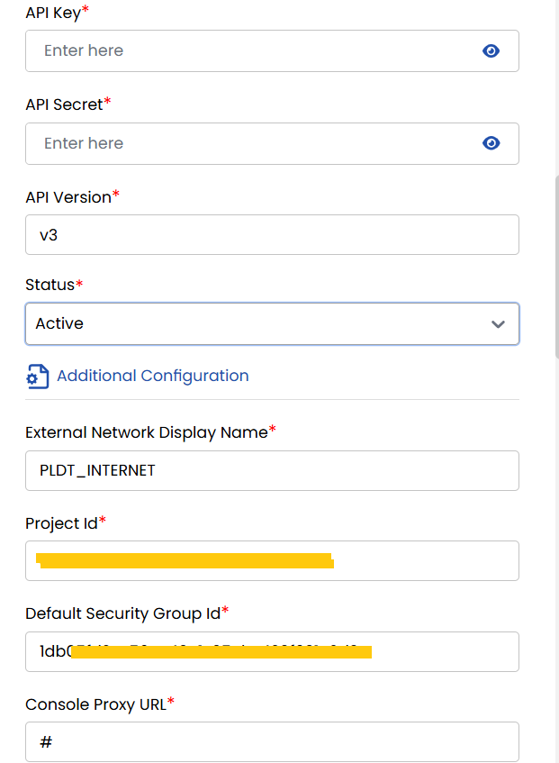

- **Domain ID:** The domain in which projects/users are created.
- **External Network ID:** UUID of the public network.
- **OpenStack Default Storage Policy:** UUID of the default Cinder storage backend.

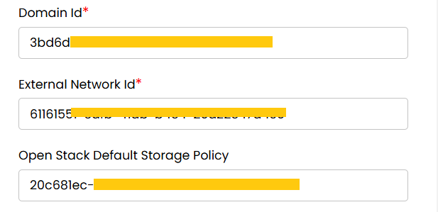

Below information is required if services are not going to be created OpenStack Default Domain: Mainly used for Virtuozzo because to perform operations on users and projects, by default, Virtuozzo does not allow it. If this is not virtuozzo, then replicate the same above credentials for below:

- **OpenStack Admin Secret:** Admin password (used for project/user creation).
- **OpenStack Admin Key:** Admin username.
- **OpenStack Admin Domain:** Admin domain (e.g., `default`).
- **OpenStack Admin Project:** Admin's main project ID.
- **OpenStack Project User Role:** Role assigned to created users (e.g., `member`, `Member` — case-sensitive).
- **One GB Multiplier (Gigabyte Definition):** Select `1024` or `1000` depending on how storage is billed.

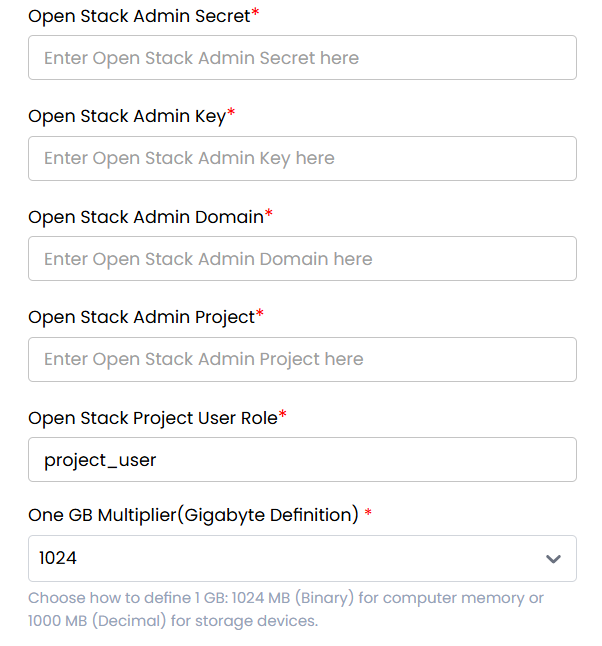

- **VM Password Required:** Choose **Yes** if a password must be set during provisioning.
- **VM SSH Required:** Choose **Yes** if SSH keys are needed.
- **OpenStack Default Network:** Choose **Yes** to set a default network for VMs.
- **OpenStack Is Domain Admin:** Select **Yes** if the configured user has domain admin rights.
- **OpenStack Set Default Quota:** Choose **Yes** to automatically apply default quotas.
- **VM Snapshot:** Select **Yes** to enable VM snapshot support.
- **Storage Cluster:** Choose available storage backend (e.g., `Ceph`).
- **Expunge VM:** Select **Yes** to permanently delete VMs on termination.
- **Project Setting:** Choose project or **Under Single Project** if all users belong to a shared project.

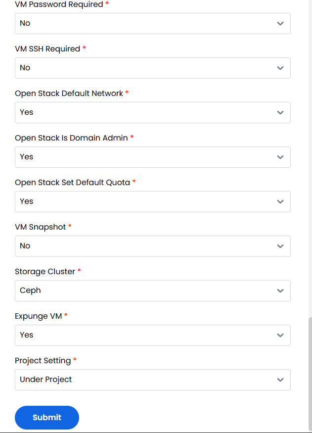

- After entering all required fields, click **Submit** to save and register the provider.

---

### Conclusion

Setting up OpenStack as a cloud provider in Stack Console ensures seamless integration with your private cloud infrastructure. A properly configured environment enables automated provisioning, user and project management, and networking with minimal manual intervention. Always validate IDs and credentials to prevent errors during provisioning.
