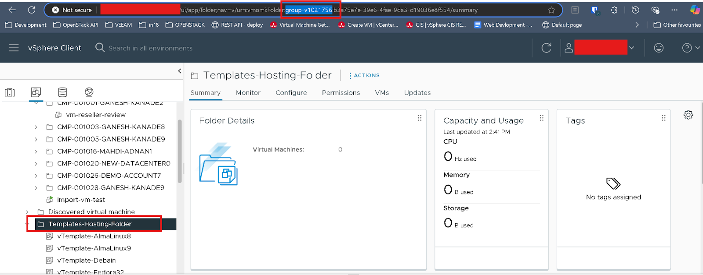
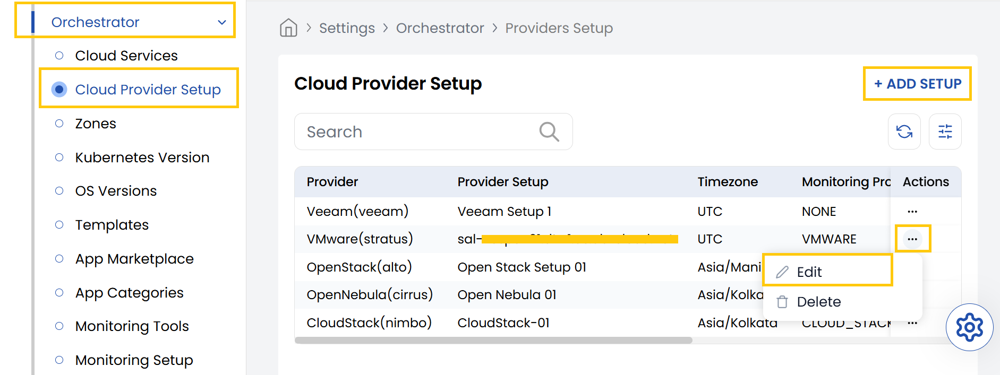
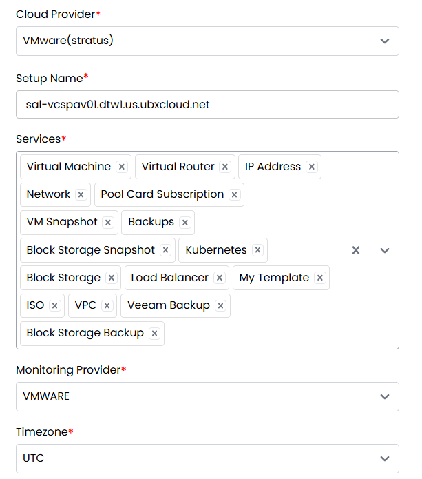
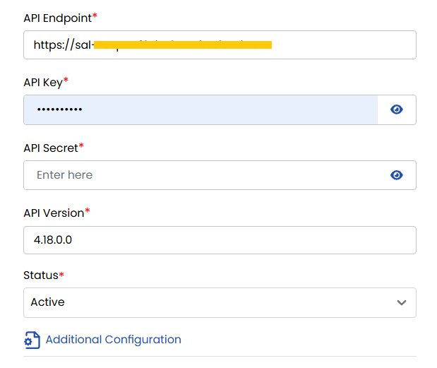
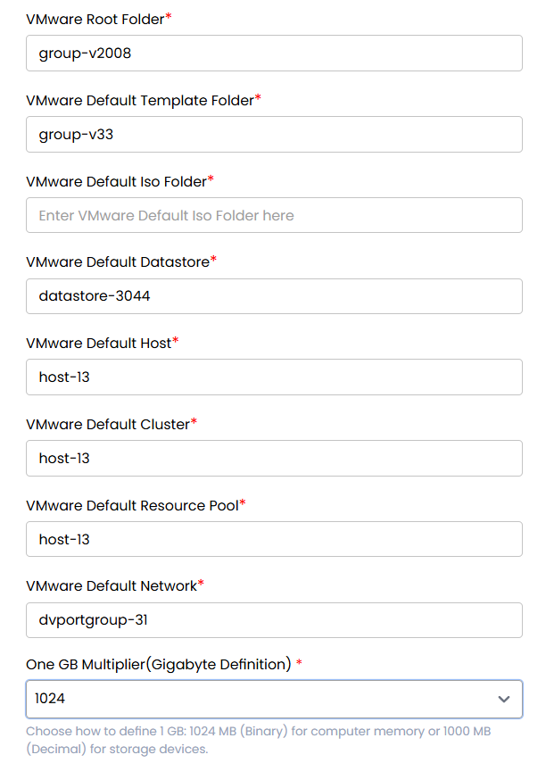

## Cloud Provider Setup for VMware in Stack Console

The **Cloud Provider Setup** tab allows administrators to add, configure, or modify cloud provider connections, enabling seamless provisioning. Here, we specifically cover environments like **VMware vCenter**.

### Pre-requsites for VMware vCenter in Stack Console

CMP fetches all VM templates from the folder configured in the Cloud Provider Setup.
- To ensure templates are listed correctly, the Template Folder ID must be configured accurately.
- Firstly, you need to collect Template folder ID from vCenter, copy the folder ID mentioned in the picture below.

### Setup a Cloud Provider Setup for VMware

- From the left-hand side of the page under the **Orchestrator** section, click on **Cloud Provider Setup** to view the list of cloud provider setups.
- To create a new cloud provider setup, click on **Add Setup**.

:::note
If the **Cloud Provider Setup** has been configured by the Stack Console team, we recommend that you only **edit** the existing details.
:::

- Click on the three dots beside the setup and click on **Edit** to change the details.

   - **Cloud Provider:** Choose from the dropdown (e.g., VMware).
   - **Name:** Enter a name for this cloud provider configuration.
   - **Services:** Select the services to enable.
   - **Monitoring Provider:** Choose the monitoring tool you wish to integrate (if any).
   - **Time Zone:** Set the appropriate time zone for this configuration.

   - **API Endpoint:** URL or IP address of the vCenter API.
   - **API Key:** Enter the **vCenter username**.
   - **API Secret:** Enter the **vCenter password**.
   - **API Version:** Specify the vCenter API version being used.
   - **Set Status:** Choose between **Active** or **Inactive** to enable or disable the configuration.

   - **VMware Root Folder ID:** Folder ID in vCenter where Stack Console will create VMs.
   - **VMware Template Folder ID:** Folder ID where VM templates are stored.
   - **Default ISO Data Store:** Datastore ID for storing ISO files.
   - **VMware VM ISO Folder Path:** Full path where ISO files are saved.
   - **Default Datastore:** Datastore ID used by default for VM creation.
   - **Default Host:** Host ID that VMs will default to, unless overridden.
   - **VMware Default Cluster:** Host Cluster ID used by default.
   - **Default Resource Pool:** Resource Pool ID for provisioning VMs.
   - **VMware Default Network:** Default network ID assigned to VMs.
   - **One GB Multiplier:** Specify how 1 GB is calculated (e.g., 1024 MB or 1000 MB).
   - **Enable Override Disk Offering:** Always set this to **"No"** for VMware configurations.

- Click **Submit** to save your cloud provider setup. Once completed, the configuration will appear in the list of setups.

---

### Conclusion

The **Cloud Provider Setup** feature in Stack Console streamlines integration with VMware environments, making it easier for administrators to configure, manage, and automate VM provisioning. Proper setup ensures efficient orchestration and compatibility with existing vCenter resources. For further help, refer to the Stack Console documentation or reach out to support.
