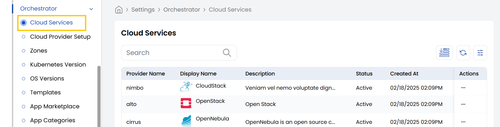

## Cloud Services

The **Cloud Services** tab allows you to view and manage the cloud services that are currently associated with various cloud providers. It provides an overview of all available services linked to each configured provider.

- From the left-hand side of the page under the **Orchestrator** section, click on **Cloud Services** to view the list of cloud services.

### Conclusion

The **Cloud Services** tab in the Stack Console offers a centralized interface to monitor and manage services across multiple cloud providers. This visibility helps streamline resource allocation and ensures smoother operations across cloud environments. For more detailed guidance, consult the Stack Console documentation or contact support.
