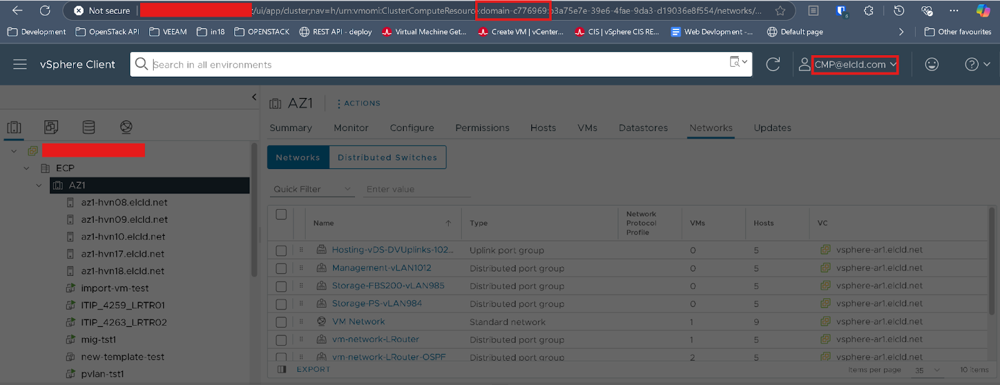
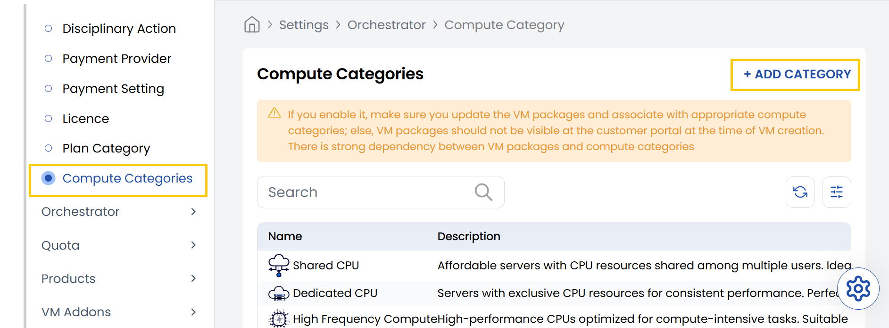
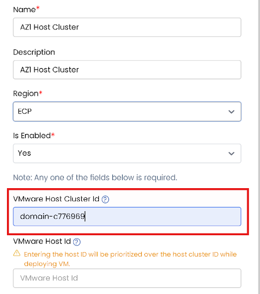
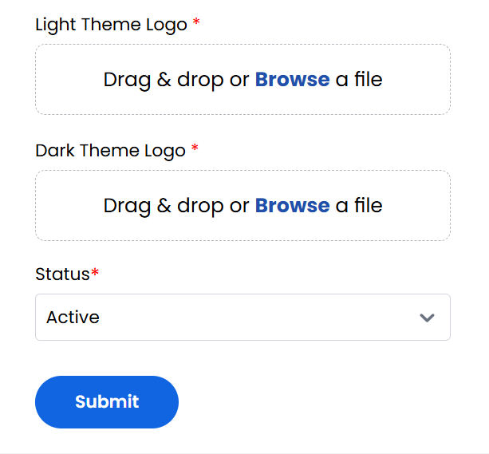

## Compute Setting for VMware in Stack Console

The **Compute Setting** tab defines the configuration used to manage compute resources such as host clusters within your cloud or on-premises infrastructure. This guide specifically covers environments like **VMware vCenter**.

### Pre-requsites for VMware vCenter in Stack Console

You can add a new Host Cluster to the Cloud Management Platform (CMP) to expand your compute capacity for virtual machine provisioning.
- CMP maps each Host Cluster to a corresponding Compute Category, so you’ll need to create a new Compute Category for the new Host Cluster.
- First, copy the ID of the Host Cluster from VMware vCenter, as shown in the image below.

### Setup a Compute Setting for VMware

- From the left-hand side of the page under the **Orchestrator** section, click on **Compute Setting** to view the list of compute configurations.
- To create a new compute setting, click on **Create Compute Setting**.
- Click on the three dots beside the setup and click on **Edit** to change the details.

:::warning

If you enable it, make sure you update the VM packages and associate with appropriate compute categories; else, VM packages should not be visible at the customer portal at the time of VM creation. There is strong dependency between VM packages and compute categories.

:::

- **Name:** Enter a name for this compute setting configuration.
- **Description:** Provide a brief description for this compute setting.
- **Region:** Select the geographic region where your compute resources are located.
- **Is Enabled:** Choose Yes to enable or No to disable this compute setting.
- **VMware Host ID:** Paste the ID of the VMware host associated with this compute setting.

:::warning

Entering the host ID will be prioritized over the host cluster ID while deploying VM.

:::

- **VMware Cluster Host ID:** Paste the ID of the VMware host cluster.

- **Light Theme Logo:** Upload or select a logo to represent this compute setting in light theme mode.
- **Dark Theme Logo:** Upload or select a logo for dark theme mode.
- **Status:** Choose between Active or Inactive to enable or disable the compute setting status.

Click **Submit** to save your compute setting. Once completed, the configuration will appear in the list of setups.

---

### Conclusion

The **Cloud Provider Setup** feature in Stack Console streamlines integration with VMware environments, making it easier for administrators to configure, manage, and automate VM provisioning. Proper setup ensures efficient orchestration and compatibility with existing vCenter resources. For further help, refer to the Stack Console documentation or reach out to support.
