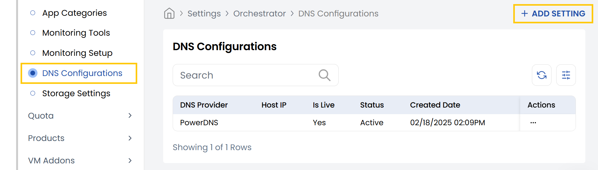
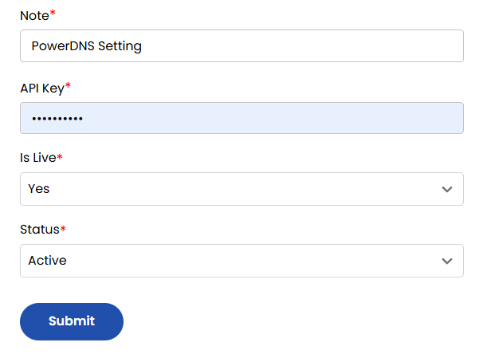

## DNS

This tab shows DNS server or software you’re using to manage DNS records. Stack Console supports multiple providers such as PowerDNS, Cloudflare (via API), etc.

- From the left-hand side of the page under the **Orchestrator** section, click on **DNS Configurations** to view the list of DNS configurations.
- To create a DNS configuration, click on **Add Settings**.

- **DNS Provider:** Select the DNS server software (e.g., PowerDNS).
- **Host IP:** Enter the IP address of the DNS server.
- **Host Port:** Specify the port the DNS API is listening on (e.g., 8081).
- **Add DNS Nameservers:** Enter each authoritative nameserver (e.g., ns1.example.com). Click to add multiple nameservers.

- **Note:** Add a description or label for this DNS setup.
- **API Key:** Enter the DNS API key.
- **Is Live:** Choose Yes/No to enable/disable this DNS config.
- **Status:** Set to Active/Inactive to use this config in production.

Click to **Submit** the config and test connectivity with the DNS server.

