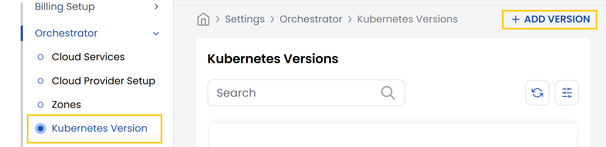
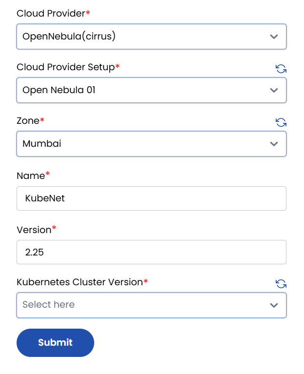

## Kubernetes Version

This tab allows you to manage **Kubernetes Version** for deployment. You can add specific Kubernetes versions supported by your cloud provider and reference them during cluster creation.

- From the left-hand side of the page under the **Orchestrator** section, click on **Kubernetes Version** to view the list of available Kubernetes versions.
- To add a new Kubernetes version, click on **Add Version**.

- **Cloud Provider:** Select the cloud provider.
- **Cloud Provider Setup:** Choose the pre-configured cloud provider setup.
- **Zone:** Select the availability zone where the version will be deployed.
- **Name:** Enter a label or name for this version configuration.
- **Version:** Specify the Kubernetes version (e.g., `1.27.3`).
- **Kubernetes Cluster Version:** Select the Kubernetes version from the available list (if applicable).

:::note

Ensure that the selected version is supported by your cloud provider and is compatible with your cluster setup.

:::
- Click on **Submit** to save the configuration and make this version available for future Kubernetes cluster deployments.

