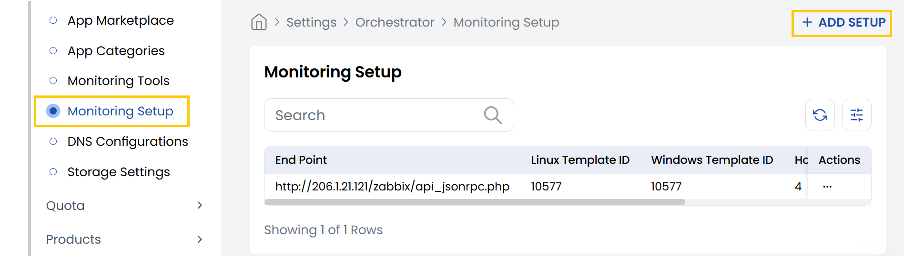
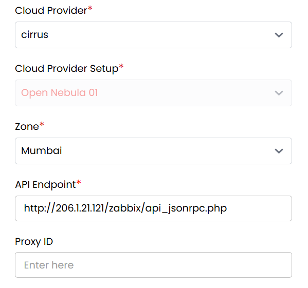
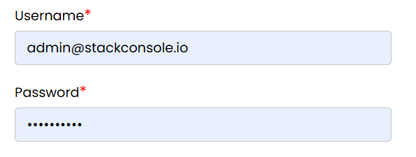
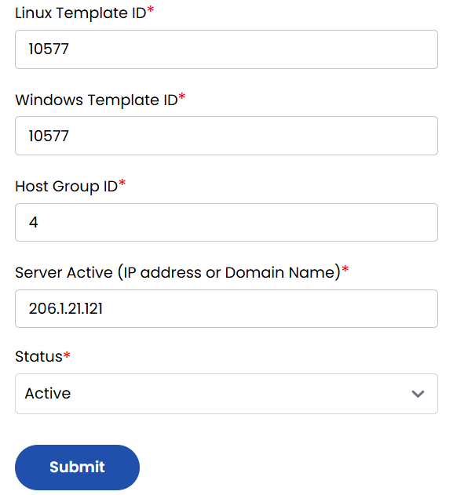

## Monitoring Setup

Effective infrastructure monitoring is essential to ensure optimal performance, availability, and security of your cloud resources. StackConsole enables seamless monitoring integration with major cloud providers such as VMware and OpenStack. This guide outlines the steps to set up monitoring for a host within StackConsole, allowing you to track system health, collect metrics, and respond to issues proactively.

- From the left-hand side of the page under the **Orchestrator** section, click on **Monitoring Setup** to view the list of monitoring setups.
- To create a new monitoring setup, click on **Add Setup**.

- **Cloud Provider:** Select your cloud provider from the dropdown (VMware, OpenStack, etc).
- **Cloud Provider Setup:** Choose the correct integration profile for the selected cloud provider.
- **Zone:** Select the zone in which the host is deployed.
- **API Endpoint:** Enter the URL of the monitoring server.
- **Proxy ID:** Enter the proxy ID if you're using a monitoring proxy (optional).

- **Username:** Use the StackConsole admin username.
- **Password:** Enter the StackConsole admin password.

- **Linux Template ID:** Enter the template ID used for monitoring Linux hosts.
- **Windows Template ID:** Enter the template ID used for monitoring Windows hosts.
- **Host Group ID:** Enter the ID of the host group where this server should be added.
- **Server Active (IP address or Domain Name):** Enter the IP address or hostname of the server to be monitored.
- **Status:** Set to Active or Inactive to enable/disable monitoring for this host.

Click the **Submit** button to save and apply the monitoring setup.