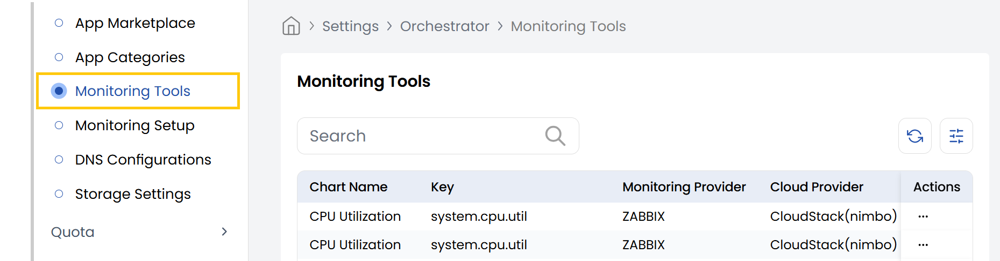

## Monitoring Tools

The **Monitoring Tools** tab in the Stack Console provides a centralized interface for viewing and editing the configuration of monitoring tools integrated with your cloud infrastructure. Rather than displaying live performance data, this section allows users to manage the data associated with monitoring metrics.

Commonly used with tools like **Zabbix** in **CloudStack (Nimbo)** setups, this tab is essential for maintaining accurate and organized monitoring configurations, ensuring that the right metrics are tracked for the right systems.

- From the left-hand side of the page under the **Orchestrator** section, click on **Monitoring Tools** to view the list of monitoring tools.

