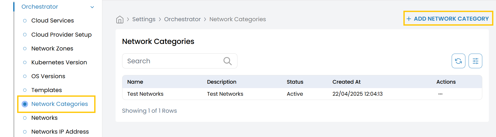
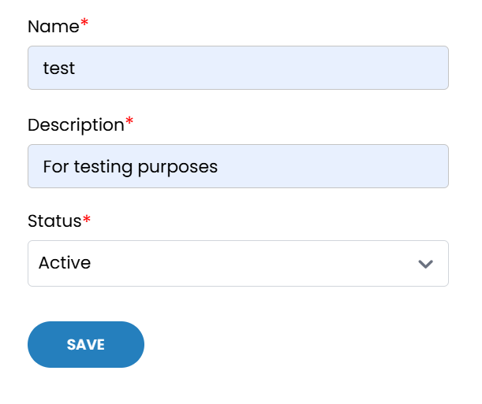

## Network Categories

This tab allows you to manage **Network Categories** used to organize and tag different network configurations within your infrastructure.

- From the left-hand side of the page under the **Orchestrator** section, click on **Network Categories** to view the list of existing categories.
- To add a new network category, click on **Add Network Category**.

- **Name:** Enter a unique name for the network category (e.g., `Internal`, `Public`, `DMZ`).
- **Description:** Provide a brief description of the network category.
- **Status:** Select the operational status of the category:
  - **Active** – Enables the category for use in configurations.
  - **Inactive** – Disables the category without deleting it.

- Click on **Save** to create and store the network category. It will now be available for selection in network-related configurations.

