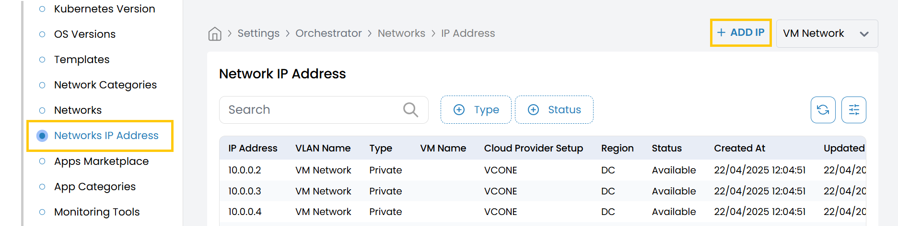
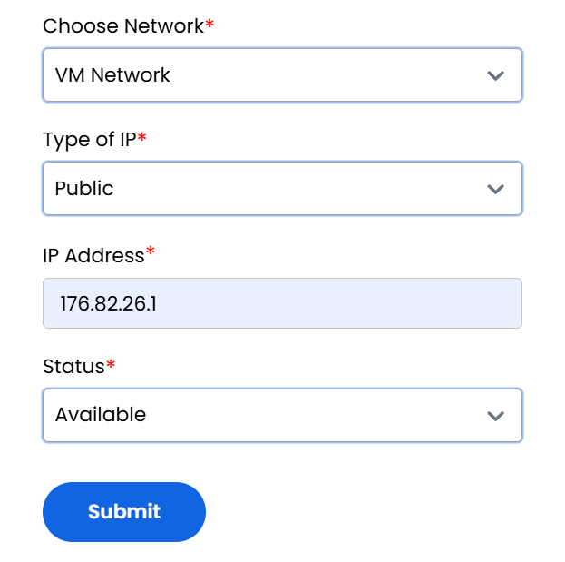

## Network IP Address

This tab allows you to manage individual IP addresses associated with configured networks. You can add public or private IPs and assign them to specific network configurations.

- From the left-hand side of the page under the **Orchestrator** section, click on **Network IP Address** to view the list of IP addresses.
- To add a new IP address, click on **Add IP**.

### IP Address Configuration Fields

- **Choose Network:** Select the associated network from the available list.
- **Type of IP:** Choose whether the IP is public or private.
  - Options: **Public**, **Private**
- **IP Address:** Enter the specific IP address to assign (e.g., `192.168.1.15`).

- **Status:** Set the status of the IP address.
  - **Active** – The IP is available for assignment.
  - **Inactive** – The IP is reserved but not currently in use.

- Click **Submit** to save and register the IP address under the selected network. The IP will now be available for assignments within your infrastructure deployments.

