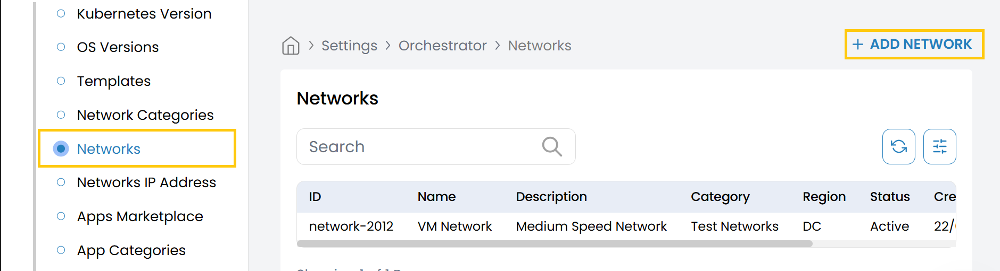
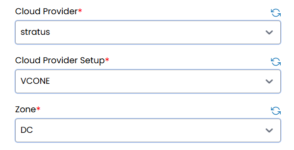
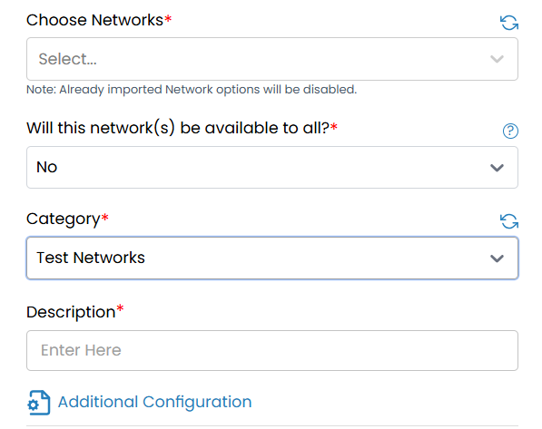
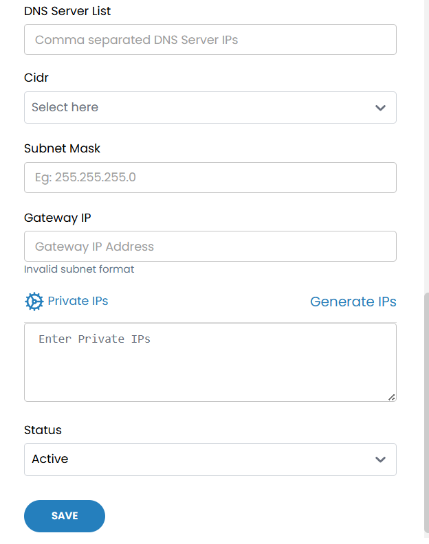

## Networks

This tab allows you to manage and assign networks from supported cloud providers. You can import and configure networks for use in your infrastructure deployments.

- From the left-hand side of the page under the **Orchestrator** section, click on **Networks** to view the list of configured networks.
- To add a new network, click on **Add Network**.

### Network Configuration Fields

- **Cloud Provider:** Select the cloud provider (e.g., AWS, Azure, GCP).
- **Cloud Provider Setup:** Choose the configured cloud provider setup.
- **Zone:** Select the availability zone to associate with this network.

:::note

Networks that have already been imported will be disabled in the dropdown.

:::

- **Choose Networks:** Select one or more networks from the list.
- **Will this network(s) be available to all?:** Choose whether the selected networks should be globally available across environments.
- **Category:** Select the appropriate network category (e.g., Internal, Public, DMZ).
- **Description:** Enter a description for the network configuration.

### Additional Configuration

- **DNS Server List:** Enter comma-separated IP addresses of DNS servers (e.g., `8.8.8.8, 8.8.4.4`).
- **CIDR:** Select the CIDR block (e.g., `192.168.1.0/24`) for this network.
- **Subnet Mask:** Enter the subnet mask (e.g., `255.255.255.0`).
- **Gateway IP:** Enter the gateway IP address.

:::note

Invalid subnet formats will prompt an error message.

:::

- **Private IPs:**
  - **Generate IPs:** Automatically generate a range of private IPs based on the selected CIDR.
  - **Enter Private IPs:** Manually enter specific IP addresses as needed.

- **Status:** Set the network status:
  - **Active** – Enables the network for use in deployments.
  - **Inactive** – Disables the network without deleting the configuration.

- Click **Save** to apply and store the network configuration. The network will now be available for use in orchestrating workloads across your selected cloud environments.

