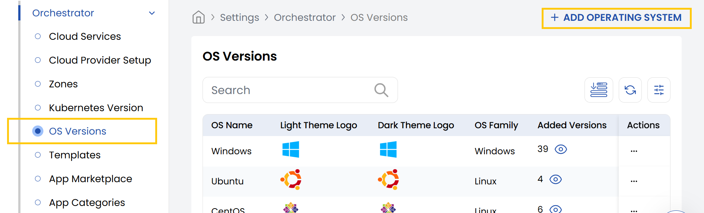
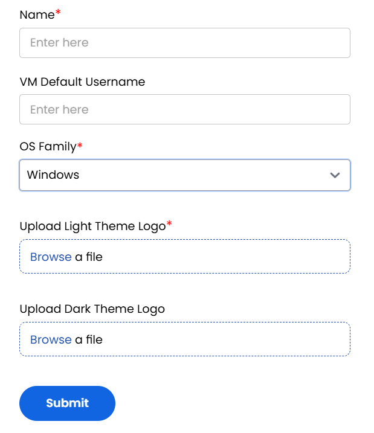

## OS Versions

- From the left-hand side of the page under the **Orchestrator** section, click on **OS Versions** to view the list of different OS Versions.
- To create a new OS, click on **Add Operating System**.

- Provide a name and VM Default Username for your operating system. Select the OS family such as from Windows, Linux or all.
- You can upload the theme logo for light and dark themes. Click **Submit** to add the new OS version.

