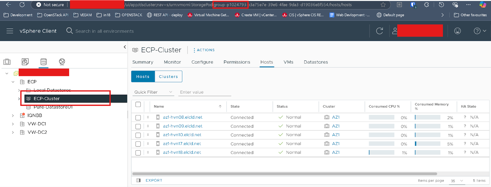
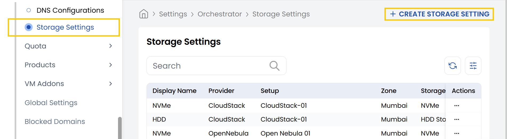
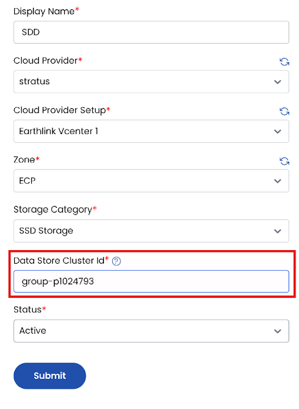

## Storage Setting for VMware in Stack Console

The **Storage Setting** tab define the configuration used to connect and manage data storage within your cloud or on-premises infrastructure. Here, we specifically cover environments like **VMware vCenter**.

### Pre-requsites for VMware vCenter in Stack Console

You can add a new Storage Cluster to the Cloud Management Platform (CMP), similar to how you add a Host Cluster. 
- CMP maps each Storage Cluster to a corresponding Storage Setting, so you’ll need to create a new Storage Setting for the new Storage Cluster.
- Firstly, you need to copy the ID of the Storage Cluster from VMware vCenter, as shown in the image below.

### Setup a Storage Setting for VMware

- From the left-hand side of the page under the **Orchestrator** section, click on **Storage Setting** to view the list of storage setting setups.
- To create a new storage setting setup, click on **Create Storage Setting**.
- Click on the three dots beside the setup and click on **Edit** to change the details.

   - **Disk Name:** Enter a name for this storage setting configuration.
   - **Cloud Provider:** Choose from the dropdown (e.g., VMware).
   - **Cloud Provider Setup:** Choose the specific configuration or credentials for the selected provider.
   - **Zone:** Choose the geographic zone where your data center will be located.
   - **Storage Category**: Choose the type of storage (e.g., Enterprise SSD, SSD, HDD, NVMe).
   - **Data Store Cluster ID:** Paste the Cluster ID you copied from the earlier setup step.
   - **Set Status:** Choose between **Active** or **Inactive** to enable or disable the configuration.

- Click **Submit** to save your storage setting setup. Once completed, the configuration will appear in the list of setups.

---

### Conclusion

The **Cloud Provider Setup** feature in Stack Console streamlines integration with VMware environments, making it easier for administrators to configure, manage, and automate VM provisioning. Proper setup ensures efficient orchestration and compatibility with existing vCenter resources. For further help, refer to the Stack Console documentation or reach out to support.
