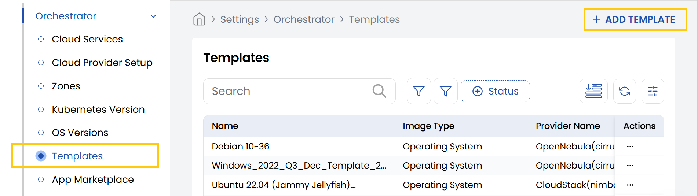
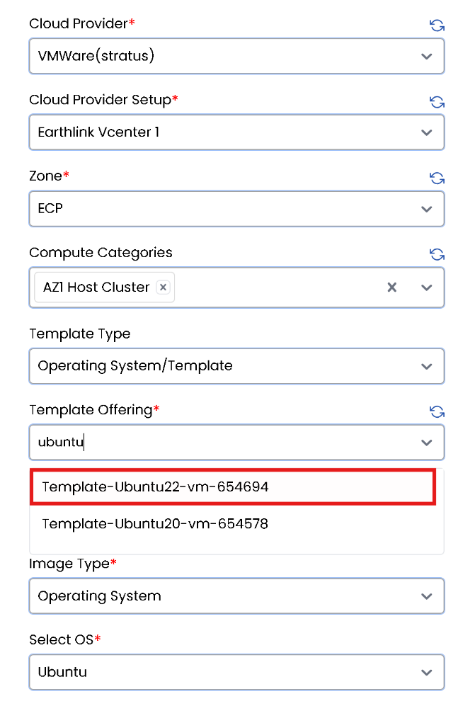
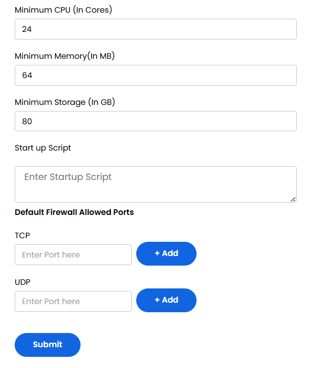

## Templates for VMware in Stack Console

The **Templates** tab provides the pre-configured virtual machine blueprint that defines the operating system, cloud provider, compute resources, networking, storage, and optional automation scripts needed to deploy VMs quickly and consistently. Here, we specifically cover environments like **VMware vCenter**.

- From the left-hand side of the page under the **Orchestrator** section, click on **Templates** to view the list of templates currently created.
- To create a new template, click on **Add Template**.
- To edit the template, click on the three dots beside the template and click on **Edit** to change the details.

   - **Cloud Provider:** Choose from the dropdown (e.g., VMware).
   - **Cloud Provider Setup:** Choose the specific setup configuration related to the selected provider.
   - **Zone:** Choose the geographic zone where your data center will be located.
   - **Name:** Enter a name for this template configuration.
   - **Compute Categories:** Choose the appropriate compute category for the template.
   - **Template Type:** Define whether the template is custom, standard, or another type.
   - **Template Offering:** Pick the offering that suits your requirements.
   - **Image Type:** Choose the type of image (e.g., ISO).
   - **Operating System:** Choose the OS for the template.

   - **OS Version:** Specify the OS version being used.
   - **Zabbix Agent:** Choose whether to use a template or cloud-init.
   - **Is Template Password Enabled?:** Choose to set as Yes or No.
   - **How Password will be set?:** Choose between using Template Script and Startup Script
   - **Does Template have the ability to reset the password?:** Choose to set as Yes or No.
   - **Does the template support setting a SSH Key using a startup script?:** Choose to set as Yes or No.
   - **Set Status:** Choose between **Active** or **Inactive** to enable or disable the configuration.
   - **Documentation Label:** Is a short name for the documentation.
   - **Documentation URL:**  The link to detailed setup or usage instructions for the template.

   - **Minimum CPU Cores:** The fewest number of CPU cores required to run this template.
   - **Minimum Memory:** Minimum RAM needed.
   - **Minimum Storage:** Disk space requirement.
   - **Add Startup Script:** Script executed when the VM first boots.
   - **TCP Port:** Open TCP ports (e.g., 22 for SSH, 80 for HTTP).
   - **UDP Port:** Open UDP ports used for fast, connectionless services (e.g., 53 for DNS, 123 for NTP).

- Click **Submit** to save and create your template. Once completed, the configuration will appear in the list of templates.

---

### Conclusion

The **Cloud Provider Setup** feature in Stack Console streamlines integration with VMware environments, making it easier for administrators to configure, manage, and automate VM provisioning. Proper setup ensures efficient orchestration and compatibility with existing vCenter resources. For further help, refer to the Stack Console documentation or reach out to support.
