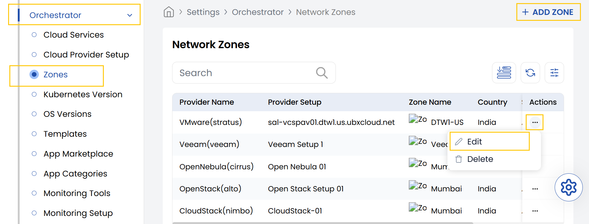
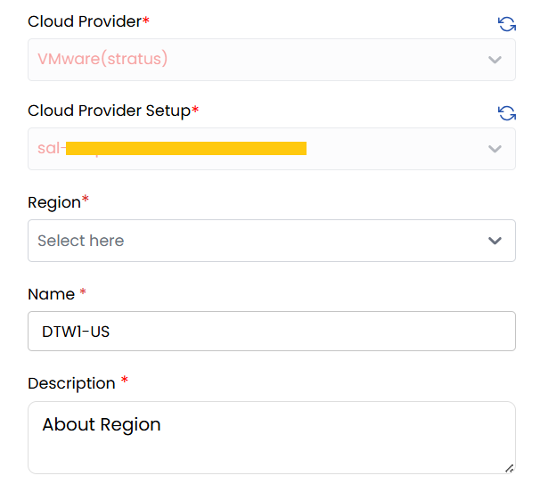
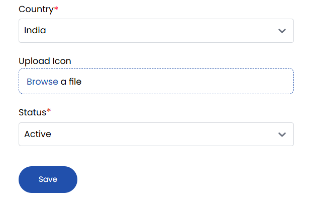

## Network Zone for VMware in Stack Console

The **Zones** tab allows administrators to add, edit, or disable a **vCenter** datacenter using the Zones option. Here, we specifically cover the **VMware vCenter** environment.

- From the left-hand side of the page under the **Orchestrator** section, click on **Zones** to view the list of created network zones. To create a new network zone, click on **Add Zone**.
- To change the details, click on the three dots beside the zone and click on the **Edit** option.

   - **Cloud Provider:** Choose the cloud provider from the dropdown (e.g., VMware).
   - **Cloud Provider Setup:** Select the appropriate cloud provider setup from the dropdown.
   - **Region:** Choose from the list of all datacenters available in VMware vCenter.
   - **Name:** Enter a name for this network zone configuration.
   - **Description:** Provide a detailed description for this network zone.

   - **Country:** Select the country where the network zone is located.
   - **Upload Icon:** Choose a file to upload as the icon representing the zone.
   - **Set Status:** Choose between **Active** or **Inactive** to enable or disable the configuration.

- Click **Save** to store your network zone. Once completed, the configuration will appear in the list of available zones.

### Conclusion

The **Network Zones** functionality in Stack Console provides a way to logically segment datacenters in your VMware environment. By configuring zones, administrators can enhance visibility, organization, and control over infrastructure deployments. For further guidance, consult the Stack Console documentation or contact support.
