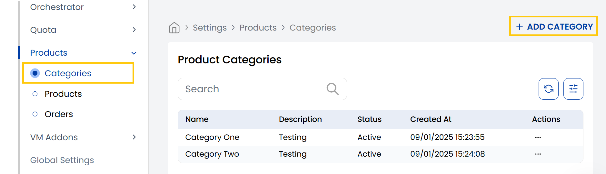
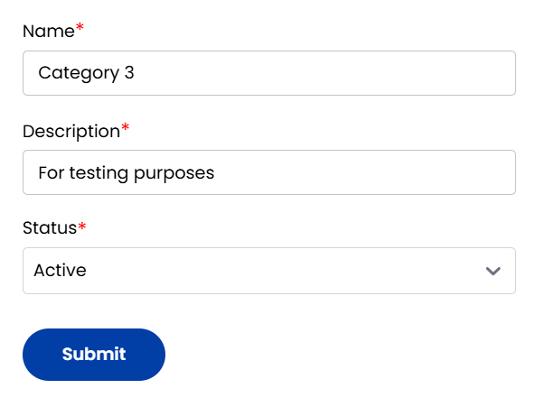

## Product Categories

The **Product Categories** tab in StackConsole allows administrators to group products into structured, easy-to-navigate classifications. Categories help organize the product catalog and enhance discoverability for both administrators and customers. Each product must belong to a category before it can be published.

-----

- From the **Products** section in the left-hand side menu, navigate to **Categories** to view all existing product categories.
- To create a new category, click on **Add Category** located on the right-hand side of the page.

- **Name:** The title of the category (e.g., "Compute", "Storage", "Backup Solutions").
- **Description:** A brief explanation of what kind of products the category contains.
- **Status:** Set the category as **Active** to make it available or **Inactive** to temporarily disabled.
  

Once all fields are completed, click **Submit** to create and save the category.

-----

## Conclusion

The **Categories** tab in StackConsole is fundamental for maintaining a well-organized product catalog. Proper use of categories enhances internal navigation, streamlines product management, and improves the customer experience when browsing your service offerings.

