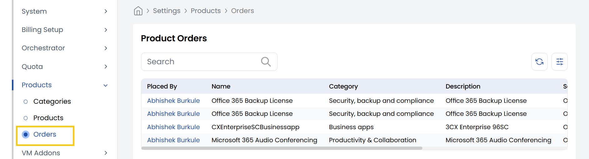

## Product Orders

The **Orders** tab in StackConsole allows administrators to view and manage all customer-initiated product purchases. Each order represents a customer's request for a specific product and contains details about the selected configurations, billing type, status, and linked services. This section is critical for tracking service delivery and lifecycle management.

-----

- From the **Products** section in the left-hand side menu, navigate to **Orders** to view all orders placed by customers.
- It allows admins to view, manage, and take action on customer-initiated product purchases, including provisioning, billing, and product tracking.

-----

## Conclusion

The **Orders** tab is central to managing the customer purchase lifecycle in StackConsole. It provides real-time visibility into customer activity, helps with troubleshooting failed or delayed provisioning, and ensures that product usage aligns with billing and service agreements.
