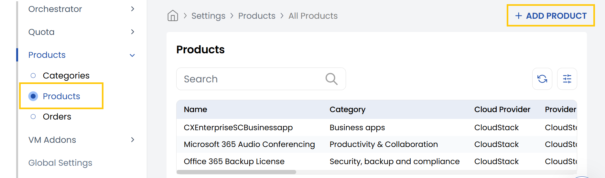
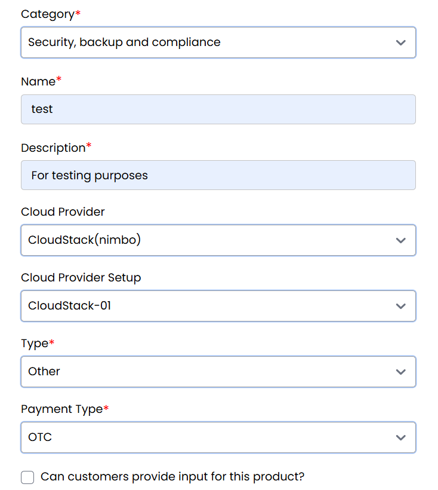
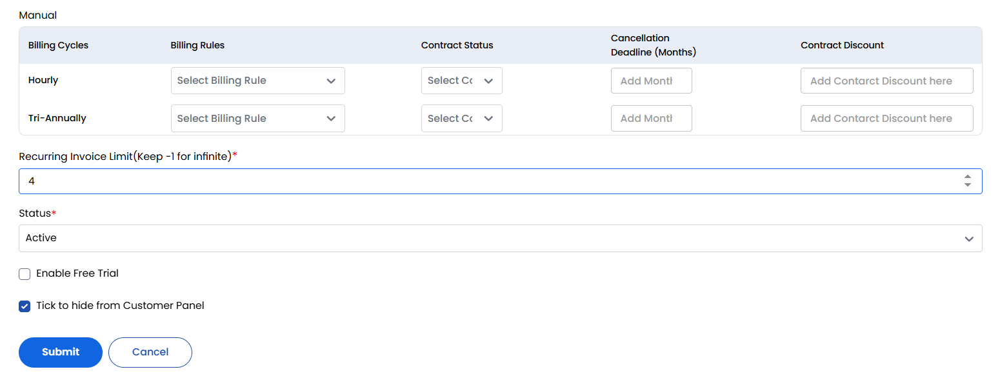

## Product Items

The **Products** tab in StackConsole allows administrators to define the cloud services, software, or resources offered to customers. Products are the core units of your service catalog and must be assigned to a category. Each product can include cloud provider integration, pricing models, billing configuration, and optional features like service contracts.

-----

- From the **Products** section in the left-hand side menu, navigate to **Products** to view the complete list of existing products.

- To create a new product, click on **Add Product** located on the right-hand side of the page.

- **Category:** Select a category under which this product will be organized.
- **Name:** Enter the name of the product (e.g., "Virtual Machine", "Block Storage").
- **Description:** Add a brief summary describing the product’s purpose.
- **Cloud Provider:** Choose the platform (e.g., AWS, Azure, OpenStack).
- **Cloud Provider Setup:** Select the appropriate configuration based on the selected provider.
- **Type:** Define the product’s nature (e.g., Compute, Backup, Add-On).

### Payment Settings:

- **Choose Payment Type:**
  - **OTC (One-Time Charge):** Single payment per purchase.
  - **Recurring:** Subscription-based payment model.
  - **Free:** No cost to the customer.
  - **Can customers provide input for this product?** Toggle if user input is required.
  - **Enable Service Contract:** Enable to attach a contract agreement to the product.

### Billing Configuration:

If the selected payment type is **Prepaid**, **Postpaid**, or **Manual**, you can configure the following:

- **Billing Cycles:** Set the frequency of invoicing (e.g., Monthly, Yearly).
- **Billing Rules:** Define limits, pricing thresholds, or tiered structures.
- **Contract Status:** Indicate if a customer must agree to a service contract.
- **Cancellation Deadline (Months):** Specify how early a cancellation notice must be given.
- **Contract Discount:** Apply discounts for long-term or contracted usage.

For advanced billing logic, refer to the **Billing Details** and **Billing Rules Documentation**.

- **Recurring Invoice Limit:** Set how many times invoices will be generated. Use `-1` for infinite.
- **Hide from Customer Panel:** Toggle this option to keep the product internal or under development.
- **Status:** Set as **Active** to available for ordering or **Inactive** to make it unavailable.

Once all settings are configured, click **Submit** to save and activate the product.

-----

## Conclusion

The **Products** tab in StackConsole is where you define and manage the core offerings of your platform. With complete control over categorization, billing models, cloud integration, and customer interaction, you can build a powerful and flexible product catalog tailored to your business needs.
