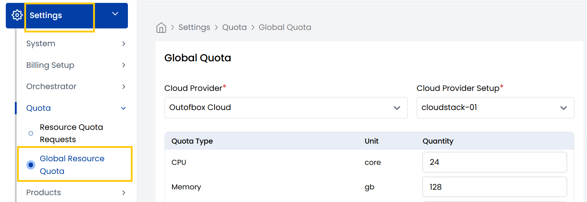

## Global Resource Quota

The **Global Resource Quota Tab** manages resource limits for clients and partners. Ensures they operate within designated resource limits. 

- You can also increase or decrease these quotas by adjusting the quantity limits.

----------

## Conclusion

The Quota system provides controlled resource allocation, enabling administrators to maintain balanced usage across client accounts while allowing flexible adjustments as needed.