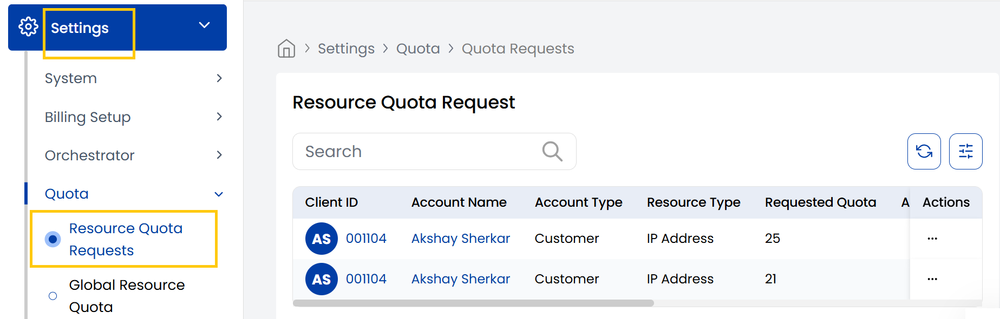

## Resource Quota Request

The **Resource Quota Request** tab manages resource quota requests from the clients to increase or decrease their resource quota.

----------

### Conclusion
The Resource Quota Request section handles client requests for resource allocation adjustments. For quota management assistance, contact Stack Console support.