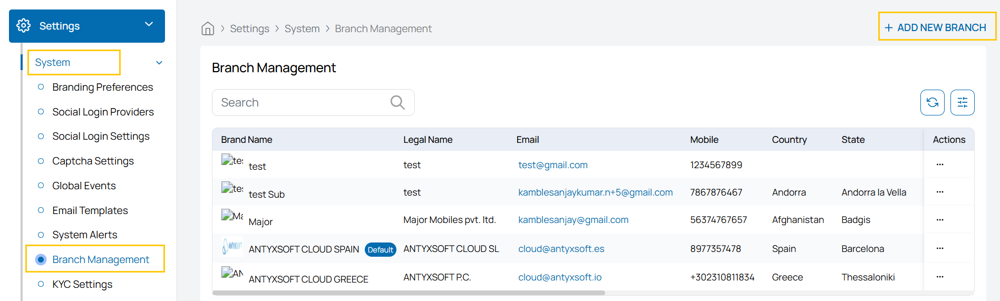
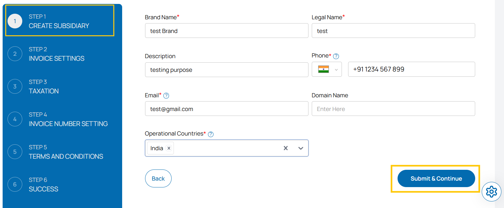
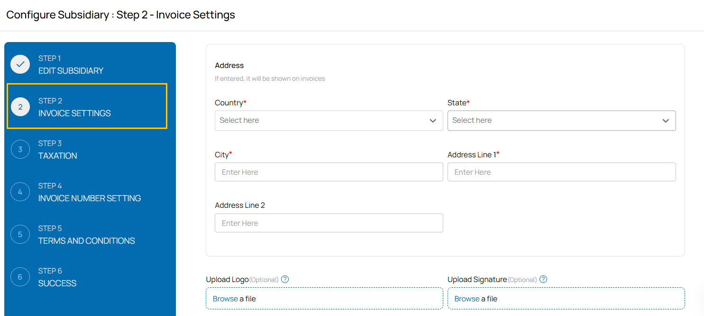
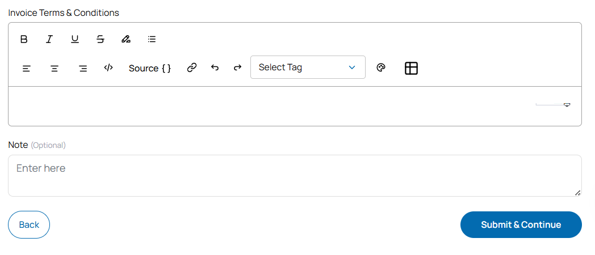
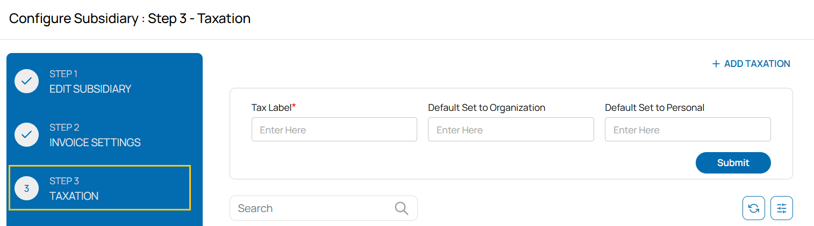
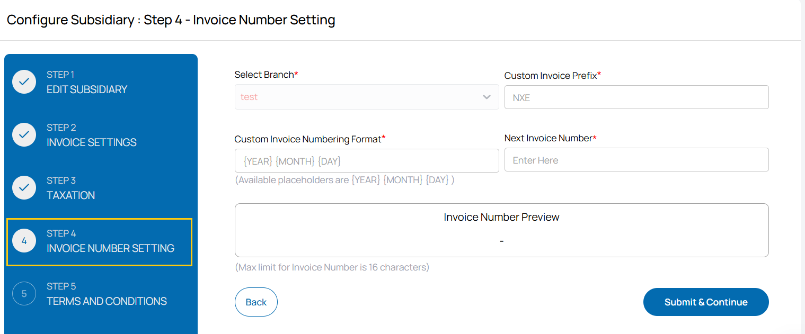
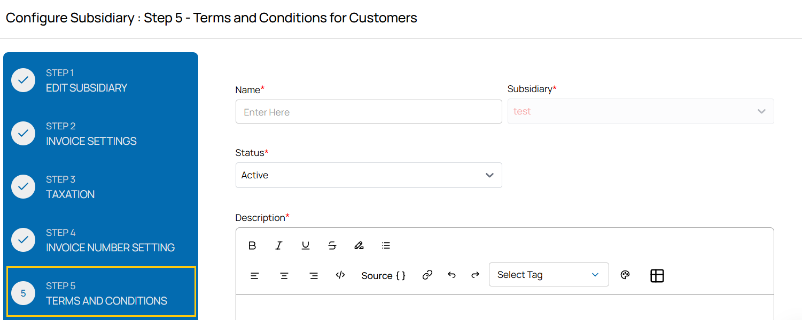
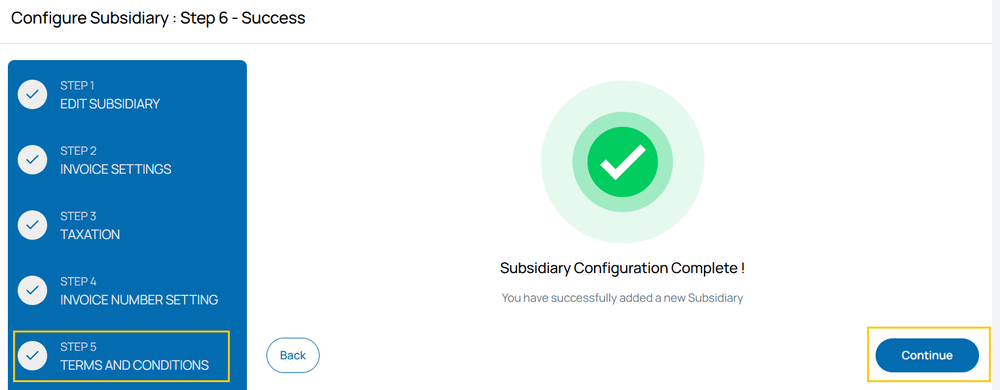

## Branch Management in Stack Console

The **Branch Management** tab allows administrators to view, manage, and create branch-specific configurations used for invoicing, taxation, and branding. Each branch can have its own contact details, logo, operational countries, and bank information. When a user registers from a country tied to a branch, all invoices and compliance data are generated accordingly; otherwise, the default branch settings are applied.

---

- From the left-hand side menu, navigate to the **Settings** tab. Under **Settings**, select the **System** option and click on **Branch Management**.
- The Branch Management page displays the available branches created.
- To create new branch, click on **Add Branch**. 

### Step 1 – Create Subsidiary

Start by providing the basic identity and contact details of the subsidiary.

- **Brand Name** – Display name for the subsidiary (e.g., `testname`).
- **Legal Name** – Registered legal name of the entity.
- **Description** – Optional text describing the purpose or details of the subsidiary.
- **Phone** – Contact phone number (e.g., `+91 12034566789`).
- **Email** – Subsidiary’s official email address (e.g., `test@gmail.com`).
- **Domain Name** – Optional domain reference for this subsidiary.
- **Operational Countries** – Select one or more countries where the subsidiary operates (e.g., `India`).

Click **Submit & Continue** to proceed.

---

### Step 2 – Invoice Settings

Configure invoice appearance and optional bank/payment details.

- **Address** – Add physical address details:
  - **Country**, **State**, **City**, **Address Line 1**, and optionally **Address Line 2**.
- **Upload Logo** – Add a company logo to be displayed on invoices (optional).
- **Upload Signature** – Digital signature for invoice authorization (optional).

- **Bank Details** – If provided, these appear on all invoices:
  - **Bank Name**, **Account Number**, **Branch**, **IFSC**, **IBAN**, **SWIFT Code**.
- **Invoice Declaration** – Additional declaration text (optional).
- **Invoice Terms & Conditions** – Standard legal terms shown on customer invoices.
- **Note (Optional)** – Internal notes for reference.

Click **Submit & Continue** to save and move to the next step.

---

### Step 3 – Taxation

Add and define tax-related configurations.

- **Tax Label** – Custom name for the tax (e.g., `GST`, `VAT`).
- **Default Set to Organization** – Tax rate or configuration for B2B customers.
- **Default Set to Personal** – Tax rate or configuration for B2C customers.

Click **Submit** to apply the tax settings.

---

### Step 4 – Invoice Number Setting

Define the format for invoice numbering to ensure consistent and traceable records.

- **Select Branch** – Choose the subsidiary/branch this format applies to.
- **Custom Invoice Prefix** – Set a custom prefix (e.g., `NXE`).
- **Custom Invoice Numbering Format** – Use placeholders to define numbering:
  - Available: `{YEAR}`, `{MONTH}`, `{DAY}`.
- **Next Invoice Number** – Enter the starting invoice number.
- **Invoice Number Preview** – A live preview of the invoice format.

:::note
The maximum allowed length for invoice numbers is 16 characters.
:::

Click **Submit & Continue** to confirm your format.

---

### Step 5 – Terms and Conditions for Customers

Set up branch-specific policies and terms.

- **Name** – A name for this T&C configuration.
- **Subsidiary** – Select the associated subsidiary.
- **Status** – Choose `Active` or `Inactive`.
- **Description** – Explain the scope or purpose of the terms.
- **Terms & Conditions Source** – Use tags or text templates as needed.

Click **Submit & Continue** once done.

---

### Step 6 – Success

You’ve successfully configured a branch in Stack Console.

The newly created branch will now be available throughout the platform for operational, billing, and customer-related workflows.

---

### Conclusion

**Branch Management** in Stack Console enables organizations to define region-specific or entity-specific operations under one unified platform. This includes branding, billing configuration, taxation, and customer communication settings for each branch. For additional guidance, consult the Stack Console documentation or contact your system administrator or support team.
