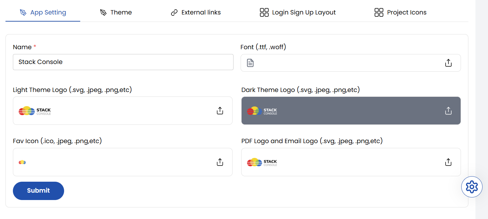
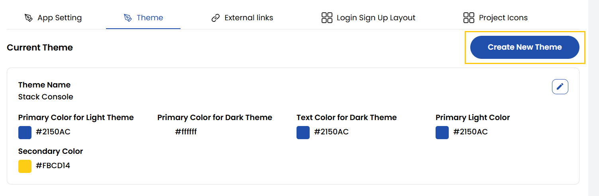
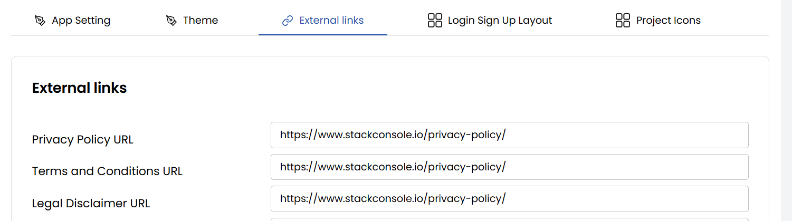
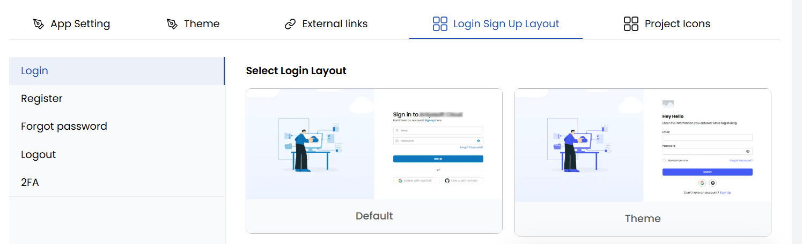
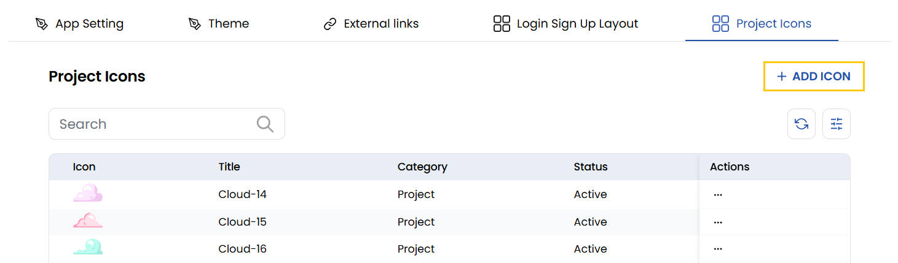
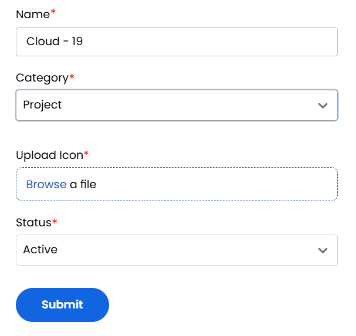

## Branding Preferences

The Stack Console's **Branding Preferences** tab allows you to customize the look and feel of the platform. Here, you can set the company name, upload fonts, logos for light and dark themes, logos, and apply custom CSS for UI changes.

### App Setting

The **App Setting** section allows you to set the foundational branding elements of your platform including name, logo, and font.

- **Name**: The brand or company name that appears across the platform.
- **Font (.ttf, .woff)**: Upload custom fonts to align your platform's typography with your brand identity.
- **Light Theme Logo (.svg, .jpeg, .png, etc)**: Logo that appears in the light-themed UI.
- **Dark Theme Logo (.svg, .jpeg, .png, etc)**: Logo that appears in the dark-themed UI.
- **Fav Icon (.ico, .jpeg, .png, etc)**: The icon that appears in browser tabs.
- **PDF Logo and Email Logo (.svg, .jpeg, .png, etc)**: Logos used in downloadable PDFs and automated email communications.
- **Submit**: Click this button to save and apply all branding changes.

### Theme

The **Theme** tab manages the visual themes of your platform. It define the color palette and UI style for the entire platform. 

- You can view available themes, check the current active theme, and create new ones by setting primary and secondary colors for light and dark modes.

    - **Theme Name**: The name you assign to identify and manage your custom theme.
    - **Primary Color for Light/Dark Theme**: The main color used across key elements like buttons and links for both light and dark modes.
    - **Text Color for Light/Dark Theme**: The color used for text in dark mode to ensure good readability.
    - **Primary Light Color**: A lighter version of the primary color used for subtle highlights and secondary elements.
    - **Secondary Color**: An additional color used to complement the primary color for less critical UI elements.

### External Links

The **External Links** tab manage important URL endpoints used across your platform for compliance, support, marketing, and legal transparency.

- **Privacy Policy URL**: Link to your company's privacy policy explaining how user data is handled.
- **Terms and Conditions URL**: Link to the terms users must accept when using your services.
- **Legal Disclaimer URL**: Link to legal disclaimers limiting liability for content and services.
- **Knowledge Base URL**: Link to a collection of help articles and user guides.
- **FAQ URL**: Link to a page answering frequently asked questions from users.
- **Service Docs URL**: Link to detailed documentation about your platform's services.
- **Service Tutorial URL**: Link to tutorials guiding users on how to use your services.
- **Product API URL**: Link to API documentation for integrating with your products.
- **API Code GitHub Repo URL**: Link to the GitHub repository containing your API source code and examples.
- **Ask a Question URL**: Link to a page where users can submit their questions or support requests.
- **SSH Key Generation Tutorial URL**: Link to a guide on generating SSH keys for secure system access.
- **Coupon Code Terms & Conditions URL**: Link to terms and conditions governing the use of coupon codes.
- **Referral Terms & Conditions URL**: Link explaining the rules and conditions of your referral program.
- **Facebook URL**: Link to your company's official Facebook page.
- **Twitter URL**: Link to your company's official Twitter (X) profile.
- **LinkedIn URL**: Link to your company's official LinkedIn profile.
- **Instagram URL**: Link to your company's official Instagram account.
- **Object Storage s3cmd Doc URL**: Link to documentation for configuring and using s3cmd with object storage.

### Login Sign Up Layout

Choose visual layout templates for authentication screens. Select templates that match branding and UX guidelines.

- **Login**: Layout customization for the user login page.
- **Register**: Layout customization for the user registration page.
- **Forgot Password**: Layout customization for the password recovery page.
- **Logout**: Layout customization for the user logout experience.
- **2FA**: Layout customization for the two-factor authentication (2FA) setup page.

### Project Icon

Choose project icons for your project or add new icon. To add new ico, click on **Add Icon** on right-hand side of the page. 

- Enter the name of the project icon, select the project and upload the image file you want to use for your icon. Select the status as active/inactive to enable or disable the icon. Click on **Submit**.

## Conclusion

The **Branding Preferences** tab provides complete flexibility to align the platform’s appearance and branding with your company identity—from theming and logos to font customization and user interface layout. This ensures a professional, cohesive, and brand-consistent experience for all users.

