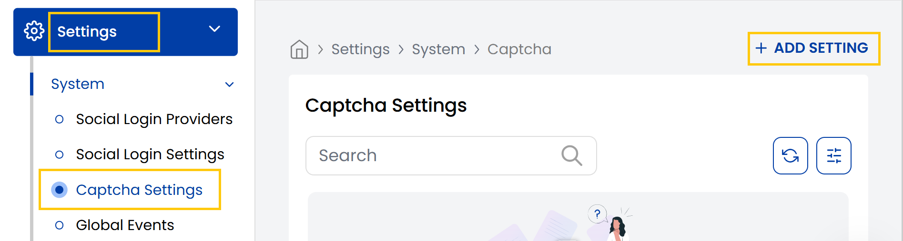
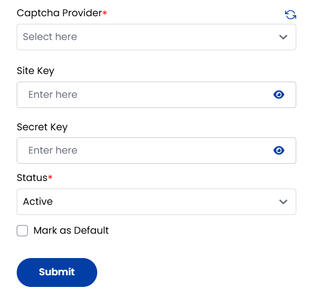

## Captcha Settings

The **Captcha Settings** tab helps protect your platform by managing Captcha integrations like Google reCAPTCHA. You can add new Captcha settings by selecting a provider, entering keys, setting status, and optionally making one default.

- From the left-hand side menu, navigate to the **Settings** tab. Under **Settings**, select the **System** option and click on **Captcha Settings**.

- The Captcha Settings page displays a list of available captcha providers.
    - **Captcha Provider**: Select the captcha provider (Google reCAPTCHA).
    - **Site Key**: Public key embedded in frontend forms.
    - **Secret Key**: Private key used in backend verification.
    - **Default**: (Optional) Mark it as the default captcha system.
- Set the status as active or inactive and click on **Submit**.

----------

### Conclusion
The Captcha Settings section provides essential bot protection through configurable CAPTCHA integrations. For security configuration assistance, contact Stack Console support.