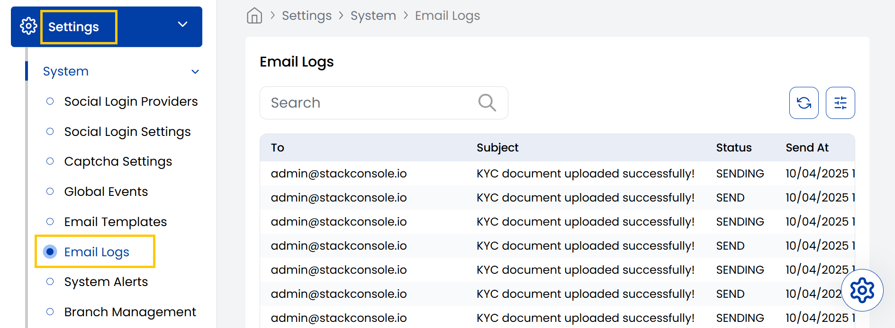

## Email Logs

The Stack Console's **Email Logs** tab displays a list of all outgoing emails along with their subject lines and delivery statuses like Sending or Sent. It helps admins monitor email communications sent from the system.

- From the left-hand side menu, navigate to the **Settings** tab. Under **Settings**, select the **System** option and click on **Email Logs**.
- The Email Logs page will displays a list of all outgoing emails.

