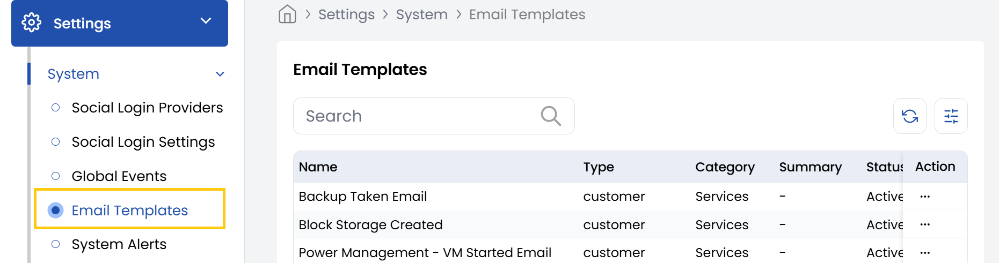

## Email Templates

The Stack Console's **Email Templates** tab provides an intuitive interface for managing email templates efficiently. The Email Templates page will display a list of available templates.

- From the left-hand side menu, navigate to the **Settings** tab. Under **Settings**, select the **System** option and click on **Email Templates**.
- The Email Templates page will display a list of available templates.
- Locate the template you wish to modify in the list. Click the Edit button next to the selected template and edit the template.

### Conclusion

The Email Templates feature enables efficient customization of your communication templates within Stack Console. By following these simple steps, you can maintain consistent messaging while tailoring templates to your specific organizational needs.