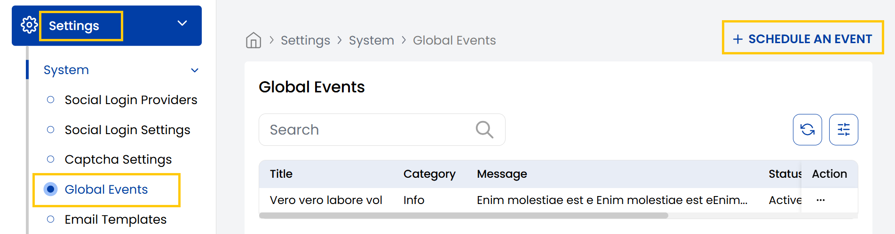
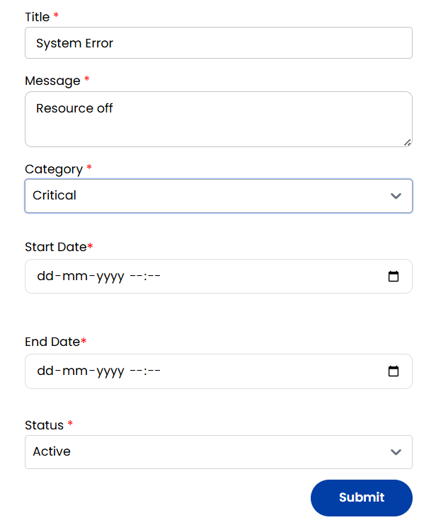

## Global Events

The Stack Console's **Global Events** tab lets you view all major system notifications or announcements. Admins can add new events by entering a title, message, selecting a category like Warning, Info, or Critical, and setting the event dates and status.

- From the left-hand side menu, navigate to the **Settings** tab. Under **Settings**, select the **System** option and click on **Global Events**.
- The Global Events page view all major system notifications or announcements. 
- To schedule a global event click on **Schedule An Event**.

- Give your event a title and description to show detailed message to users.
- Choose a Category from:
    - **Info**: General information.
    - **Warning**: Alert users but not urgent.
    - **Critical**: Immediate action required.
- Select the start and end date of the event, set status active or inactive according to your preference and click on **Submit**.

