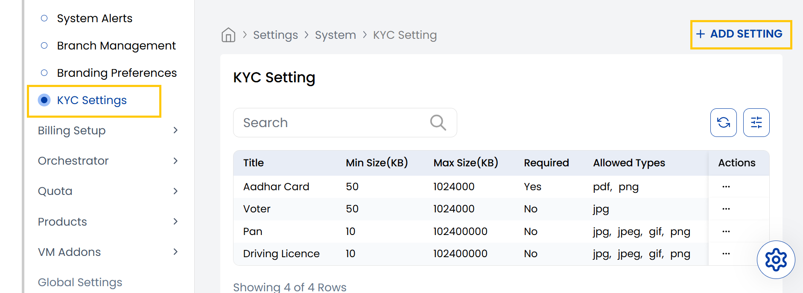
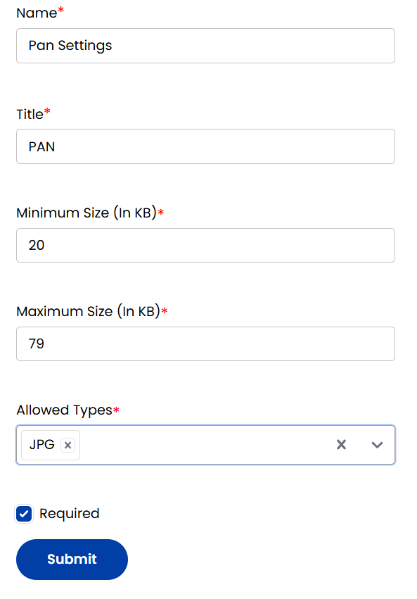

## KYC Settings

The Stack Console's **KYC Settings** tab enables admins to define document requirements for verifying customer identities.

- From the left-hand side menu, navigate to the **Settings** tab. Under **Settings**, select the **System** option and click on **KYC Settings**.
- The KYC Settings page displays a list of all KYC settings available.

- To create a new **KYC Settings** click on **Add Setting** located on the right-hand side of the page.
- You can add KYC settings by specifying document name and title. Specify the file size limits and allowed file types (jpg, png, pdf, gif).
- Click on required to make the submission mandatory and click on **Submit**.

----------

### Conclusion
The KYC Settings section provides configurable identity verification requirements for customer onboarding. For KYC configuration assistance, contact Stack Console support.