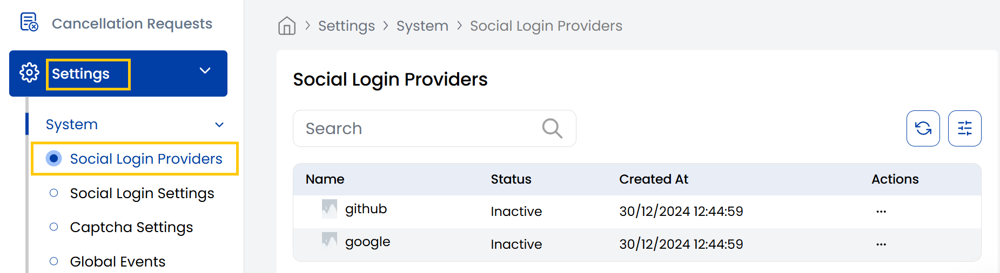

## Social Login Providers

The Stack Console's **Social Login Providers** tab allows users to sign up or log in using accounts from trusted platforms (e.g., Google, Facebook, GitHub), instead of creating a new username and password. Admins can view existing login providers and manage them easily from this section.

- From the left-hand side menu, navigate to the **Settings** tab. Under **Settings**, select the **System** option and click on **Social Login Providers**.
- The Social Login Providers page displays the available social platforms users can log in with, such as Google or Facebook. 

----------

### Conclusion
The Social Login Providers section enables seamless authentication through trusted third-party platforms. For configuration assistance, contact Stack Console support.