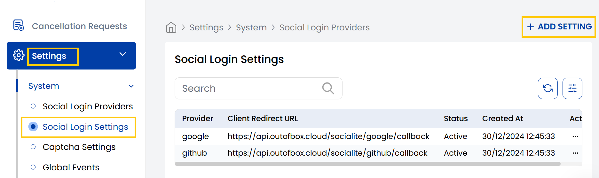

## Social Login Settings

The Stack Console's **Social Login Settings** tab allows you to add new social login (e.g., Google, Facebook, GitHub) credentials by entering the client ID, client secret, and setting the status to active or inactive.

- From the left-hand side menu, navigate to the **Settings** tab. Under **Settings**, select the **System** option and click on **Social Login Settings**.
- The Social Login Settings page displays the available social platforms created for users.
- To create new social login click on **Add Setting**. 

- **Select Provider** (e.g., Google, Facebook, LinkedIn) and fill up the client information:
    - **Client ID**: A public identifier of your application, obtained from provider’s developer console.
    - **Client Secret**: A secret known only to the app and the authorization server.
- Set the status as active or inactive and click on **Submit**.