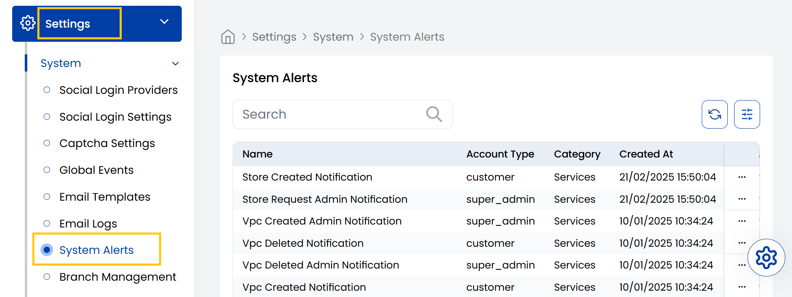

## System Alerts

The Stack Console's **System Alerts** tab shows important system-triggered notifications like Store Creation, VPC Changes, and Network Events. Each alert displays the action performed, user involved, service name, date, and current status.

- From the left-hand side menu, navigate to the **Settings** tab. Under **Settings**, select the **System** option and click on **System Alerts**.
- The System Alerts page shows important system-triggered notifications.

----------

### Conclusion
The System Alerts section provides real-time visibility into critical system activities and changes. For alert management assistance, contact Stack Console support.