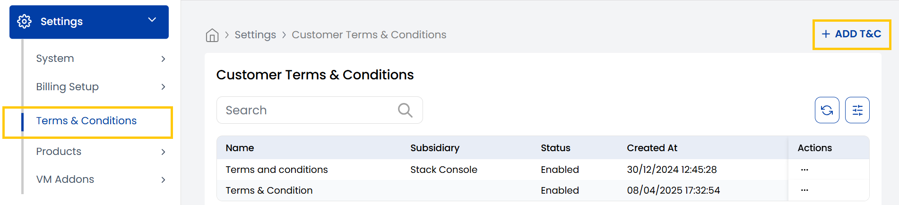
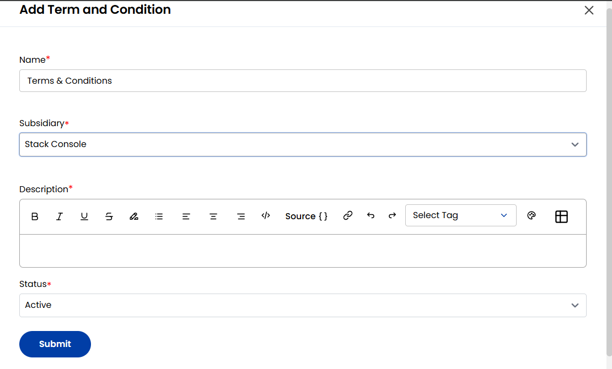

## Terms & Conditions

The **Terms & Conditions** tab provides a comprehensive view of all the list of Terms & Conditions for customers associated with your organization.  

-----

- You can easily manage existing entries or create new Terms & Conditions by clicking the **Add T&C** option located on the right-hand side of the page.

- When creating **Terms & Conditions**, enter the name and subsidiary business associated with it. 
- Enter description with detailed information and set status to Active or Inactive as needed. Click on **Submit**.

This tab helps ensure that all customer agreements are properly documented and maintained for accurate referencing and compliance.

-----

## Conclusion

Using the **Terms & Conditions** tab in Stack Console allows your organization to manage contractual documentation with clarity and consistency. Keeping this information updated ensures transparency and compliance with your business operations.
