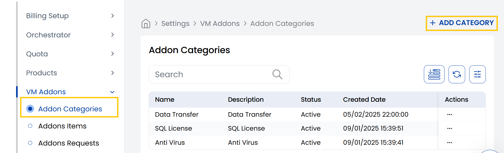
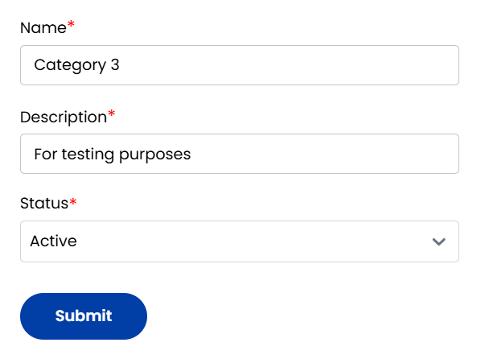

## VM Addon Category

The **VM Addon** in StackConsole is designed to group and manage add-on products or services that extend the functionality of Virtual Machines.

-----

- From the **VM Addon** section in the left-hand side menu, navigate to **Addon Categories** to view all available categories.
- To create a dedicated category for VM add-ons, click on **Add Category** located on the right-hand side of the page.

- **Name:** Give it a VM category descriptive name.
- **Description:** A brief explanation of what kind of VM addon category contains.
- **Status:** Set the category as **Active** to make it available or **Inactive** to temporarily disabled.

Click **Submit** to create the category.

-----

## Conclusion

The **VM Addon Category** helps logically group auxiliary services related to virtual machines, simplifying both management and customer discovery of essential VM enhancements within your StackConsole platform.
