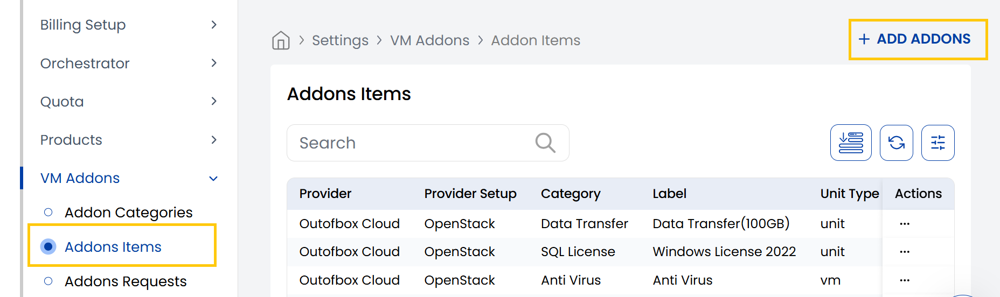
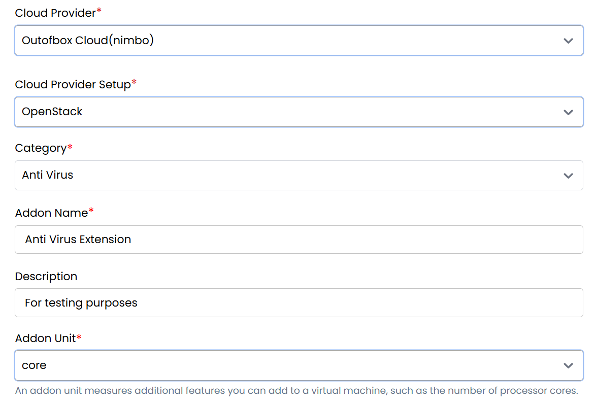
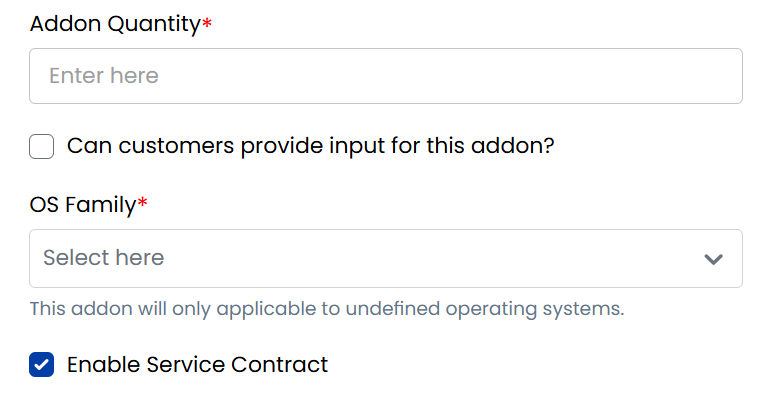
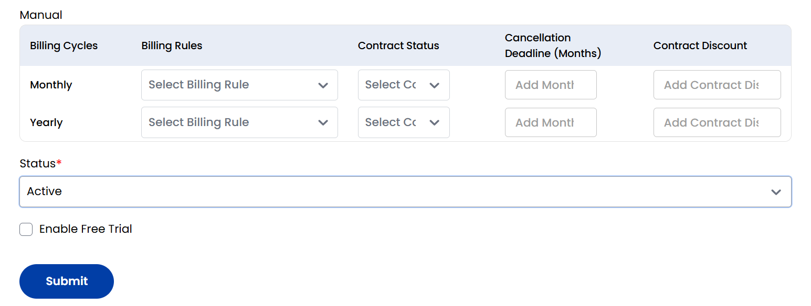

## VM Addon Items

The **VM Addon Items** section in StackConsole allows administrators to define optional, chargeable enhancements that extend core products—most commonly used for Virtual Machines. Examples include extra storage, public IPs, CPU cores, or OS licenses. Addons are attached to categories and linked to specific cloud provider setups for seamless provisioning.

-----

- From the **VM Addon** section in the left-hand menu, go to **Addon Items** to view existing addon items.
- To create a new addon, click **Add Addons** from the right-hand side of the page.

- **Cloud Provider:** Select the target platform (e.g., VMware, OpenStack).
- **Cloud Provider Setup:** Choose the configured cloud setup from the dropdown.
- **Category:** Select the addon category.
- **Addon Name:** Enter a descriptive namenfor Addon.
- **Description:** A short summary of the addon’s purpose.
- **Addon Unit:** An addon unit measures additional features you can add to a virtual machine, such as the number of processor cores.
- **Addon Quantity:** Quantity per unit (e.g., 1 IP, 4 vCPUs).

- **Can customers provide input for this addon?** Tick if user input is required.
- **OS Family:** Specify operating systems this addon applies to.
- **Enable Service Contract:** Require contract agreement if needed.
- **Enable Free Trial:** Allow customers to use this addon at no charge during a trial.

### Billing Configuration

Addons support **Prepaid**, **Postpaid**, and **Manual** billing models. For each model, you can configure settings by billing cycle.

- **Billing Cycles Supported:** Hourly, Monthly, Quarterly, Semi-Annually, Yearly, Bi-Annually, Tri-Annually.
- For each cycle, define:
  - **Billing Rules:** Select applicable pricing logic.
  - **Contract Status:** Choose whether a contract is required or optional.
  - **Cancellation Deadline (Months):** Enter how early cancellation notice must be given.
  - **Contract Discount:** Apply a discount if committing to a contract.

Refer to the **Billing Rules** documentation for creating and managing pricing logic, and the **Contracts** section for setting contract terms and lifecycle options.

- **Status:** Set as **Active** to make the addon available for customers, or **Inactive** to hide it.
- Click **Submit** to save and publish the addon item.

-----

## Conclusion

The **Addon Items** tab lets you define flexible, configurable enhancements for your core products. By combining cloud integration, unit-based billing, and customer-level controls, StackConsole empowers you to deliver scalable infrastructure services tailored to your users’ specific needs.
