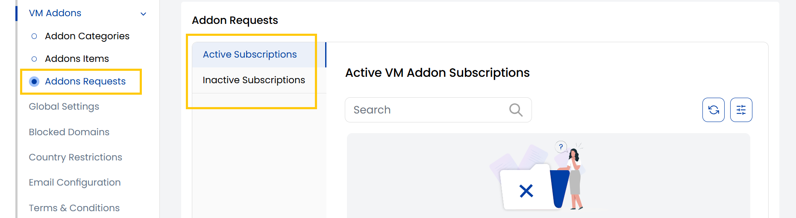

## VM Addon Requests

The **VM Addon Requests** tab helps you manage user-submitted actions related to VM addon services—such as requests to add or remove extra features like CPUs, storage, or IPs.

- From the **VM Addon** section in the left-hand menu, go to **Addon Requests** to view existing VM addon requests.

- **Active VM Addon Requests** – Displays all ongoing or pending addon requests that require review or processing.
- **Inactive VM Addon Requests** – Lists addon requests that have already been approved, rejected, completed, or canceled.

---

### Conclusion

The VM Addon Requests tab offers a clear view of all addon-related service actions, distinguishing between active and inactive requests for smooth and organized request management.
