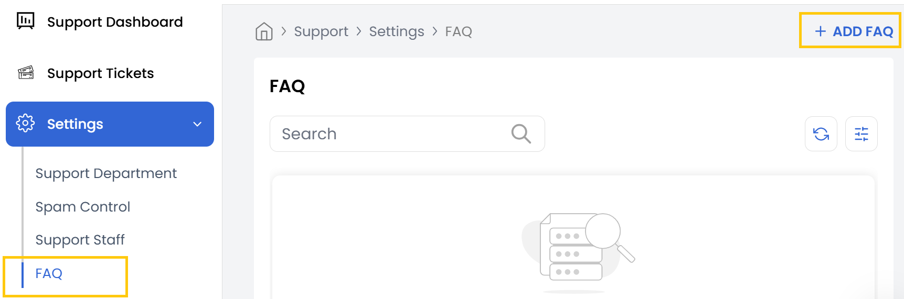

## FAQs

The FAQ tab is used to create and manage frequently asked questions to assist customers and reduce ticket volume. FAQs serve as a valuable resource for self-service support, reducing repetitive inquiries.

- To View and Add a New FAQ, navigate to the FAQ tab. Click on Add FAQ.

- Enter the following information:

    - **Category** – The FAQ category for better organization.
    - **Question** – The frequently asked question.
    - **Answer** – The detailed response or solution.
    - **Status** – Choose whether the FAQ should be Active or Inactive.

- Click Submit to create the new FAQ entry.
