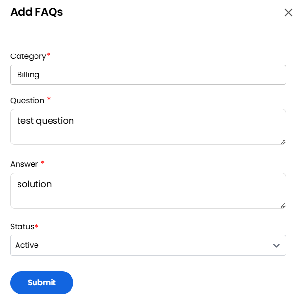

## Add FAQs

The FAQ tab is used to create and manage frequently asked questions to assist customers and reduce ticket volume. FAQs serve as a valuable resource for self-service support, reducing repetitive inquiries.

- To View and Add a New FAQ, navigate to the FAQ tab. Click on Add FAQ.

- Enter the FAQ category, the frequently asked **Question** and **Answer** with the detailed response.
- Choose whether the **Status** of FAQ should be Active or Inactive and click **Submit** to create the new FAQ entry.

### Conclusion

The FAQ management system provides an effective way to build a self-service knowledge base for your customers. By maintaining comprehensive and well-organized FAQs, you can improve customer experience while reducing the workload on your support team.