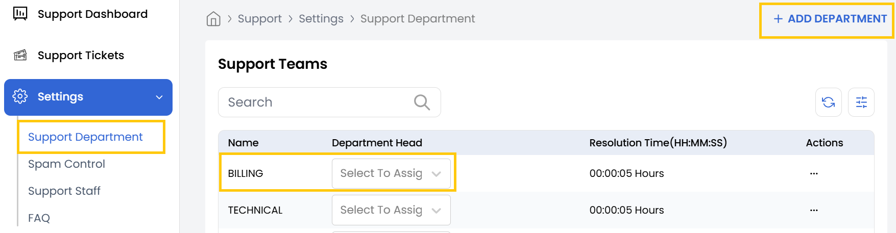
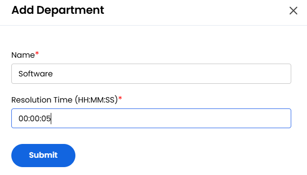

## Support Department Management

The **Support Department** section allows users to create and manage departments within the support structure. Each department has a Department Head that ensures accountability and organized ticket handling.

---

- From the **Settings** tab, click on **Support Department** to view support teams.  
- Each department should have a designated **Department Head**, who will oversee and manage ticket flow within that department. Select one department head for each department.

- To add a new department, select **Add Department**.  
- Enter the **Department Name** and define the expected **Resolution Time** for tickets assigned to this department. Click **Submit** to save the new department.

### Conclusion

The Support Department feature provides an organized way to manage your support teams and ticket handling. By creating departments and assigning dedicated heads, you can ensure efficient resolution of support requests within your organization.