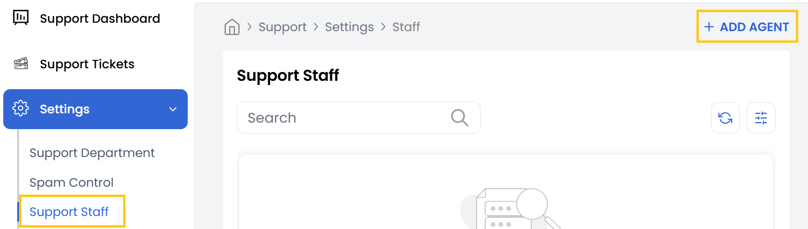
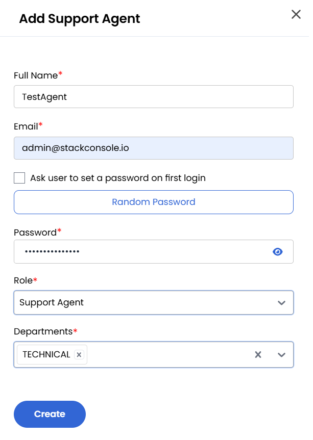

## Support Staff Management

The Support Staff section is designed for creating and managing support team members.

- To Add a New Support Agent, navigate to the **Support Staff** section and click on **Add Agent**.

- Enter the Name, Email and Password. You can ask User to Set Password on first login or generate a secure password automatically.
- Select the agent's Role:

    - **Support Admin** - Users with administrative rights to manage dashboard settings.
    - **Support Agent** - Users responsible for handling customer tickets.

- Assign the agent to a Department for role-specific responsibilities and click **Create** to finalize the agent profile.

### Conclusion

The Support Staff management feature enables efficient organization of your support team. By creating agents with specific roles and department assignments, you can streamline ticket resolution and maintain clear responsibility structures within your support organization.