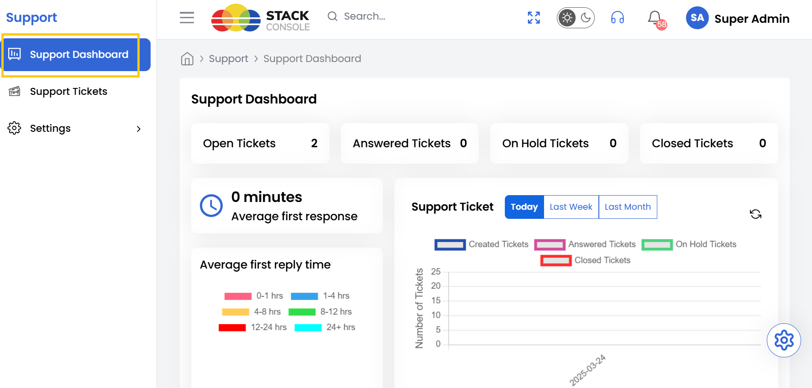
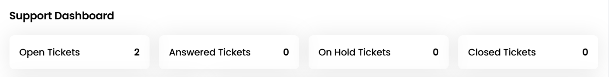
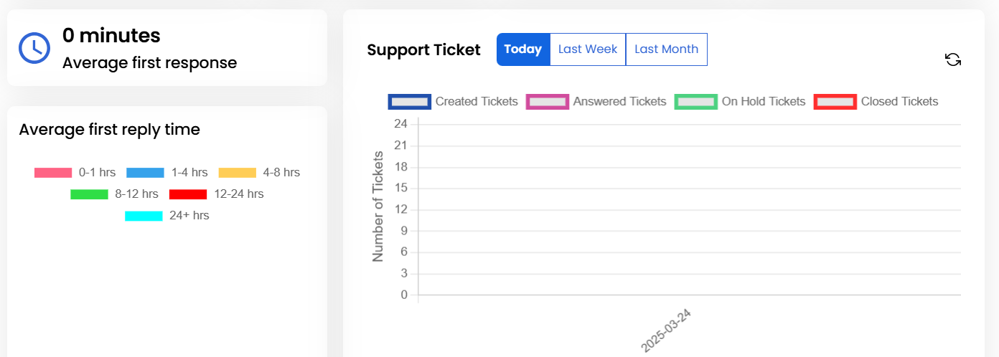

The Stack Console Support Dashboard is a centralized platform that allows support teams to efficiently manage customer inquiries, track ticket statuses, and monitor team performance. This document provides a detailed guide to navigating the dashboard, understanding its features, and performing key actions.

------

### Accessing the Support Dashboard

- To access the Support Dashboard from the left-hand side menu, select Support tab. Click on Support Dashboard.

### Support Tickets Status

- Upon accessing the Support Dashboard, you will find several key metrics and insights. The dashboard displays the following key ticket categories status:

    - **Open Tickets** – Tickets that are currently active and awaiting resolution.
    - **Answered Tickets** – Tickets that have received a response from a support agent.
    - **On Hold Tickets** – Tickets that have been temporarily paused for further investigation or follow-up.
    - **Closed Tickets** – Tickets that have been successfully resolved and closed.

### Support Ticket Performance Metrics

- These metrics help teams measure responsiveness and improve customer satisfaction. In addition to ticket summaries, the Support Dashboard provides performance insights:

    - **Average Reply Time** – The average time taken by support agents to respond to customer inquiries.
    - **Average First Response Time** – The average time taken for the initial response after a ticket is created.

- The dashboard also offers a timeline view, showing ticket activity trends. This feature allows us to track workload patterns, identify peak activity periods, and adjust resource allocation accordingly.

