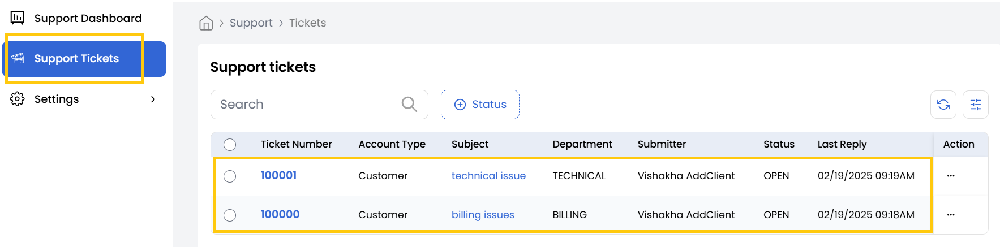
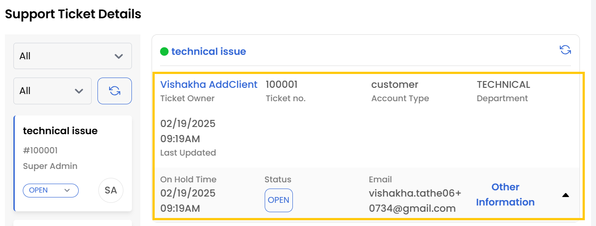
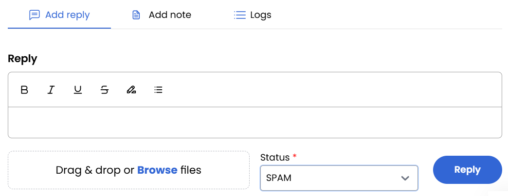
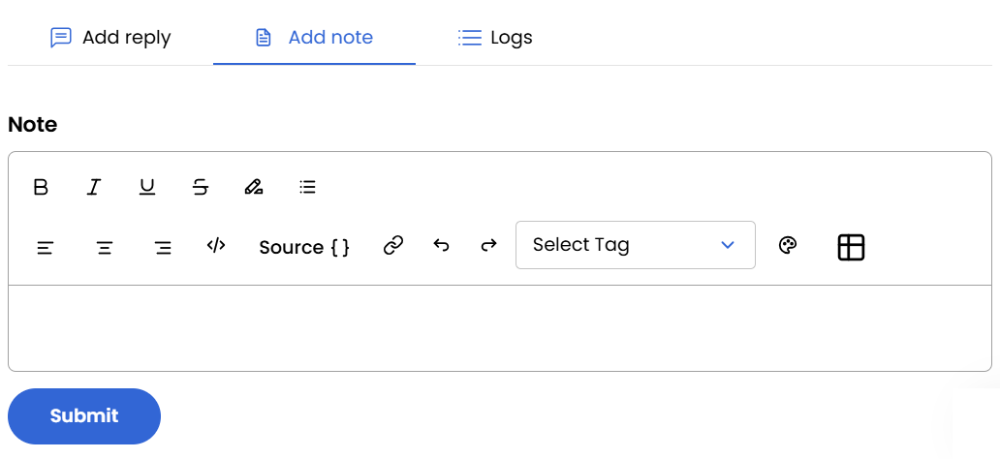
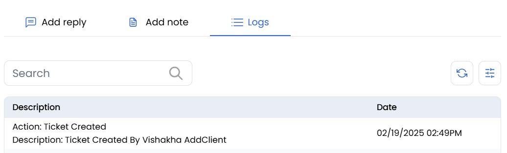

## Support Tickets

The **Support Tickets** tab provides detailed information about individual support tickets and their statuses.

### Viewing Ticket Status

In the Support Tickets tab, you can filter tickets based on their status. Available status categories include:

    - **Open** - Active tickets awaiting a response or resolution.
    - **On Hold** - Tickets temporarily paused for additional information or action.
    - **Answered** - Tickets that have received a reply.
    - **Archived** - Old or inactive tickets stored for record-keeping.
    - **Customer Reply** - Customer replied on tickets status categories defined by your organization.
    - **Spammed** - Tickets flagged as spam.
    - **Closed** - Tickets that have been fully resolved.

### Viewing Ticket Details

- To view the details of a specific ticket. Locate the desired ticket and click on the corresponding Ticket Number to open the detailed view.

- In the detailed ticket view, the following information is available:

    - **Ticket Owner** - The user name who created the ticket.
    - **Ticket Number** - The unique identifier assigned to the ticket.
    - **Account Type** - Displays the account type or profile of the customer who raised the ticket.
    - **Department** - Indicates the department handling the ticket.
    - **Last Updated** - The most recent timestamp when the ticket was placed.
    - **Status** - The current state of the ticket (e.g., Open, Closed, On Hold).
    - **Email** - The email address associated with the ticket for communication.

### Ticket Management Actions

- In the ticket details view, you can perform the following actions:

    - **Add a Reply** - Compose and send a direct response to the ticket.

    - **Add a Note** - Add internal comments visible only to the support team.

    - **View Logs** - Access a comprehensive history of ticket actions, updates, and agent interactions.

### Conclusion

The Support Tickets section offers comprehensive tools for tracking, managing, and resolving customer inquiries. By utilizing the detailed ticket view and management actions, support teams can maintain organized communication, document internal notes, and ensure timely resolution of all customer issues.