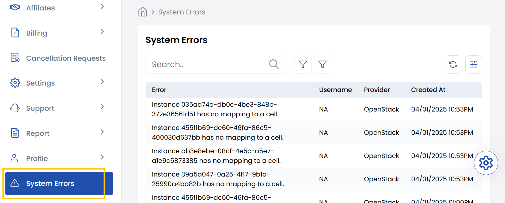

## System Error Overview

The **System Error** tab in Stack Console displays detailed records of operational errors occurring across the platform. Each log entry includes key details such as the error message, username associated with the action, and the cloud provider (e.g., Cloud Stack).

- These errors typically arise from failed API operations or misconfigurations—such as applying invalid IP reservations, attempting to delete a VPC still in use, or assigning a default NIC that’s already set. 

-----

- By showing the originating account or user, the log helps administrators trace issues back to specific actions, making debugging faster and more accurate.

-----

## Conclusion

The **System Errors** tab acts as a centralized logging tool for monitoring and diagnosing failures. It equips administrators with the context needed to investigate and resolve issues efficiently, ensuring smoother platform operations and minimizing downtime.
