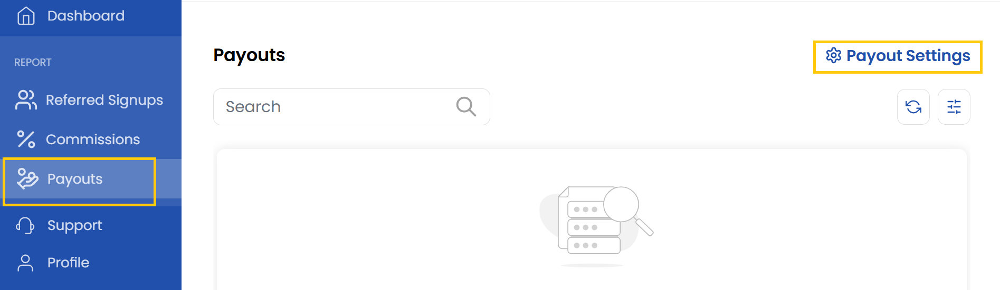
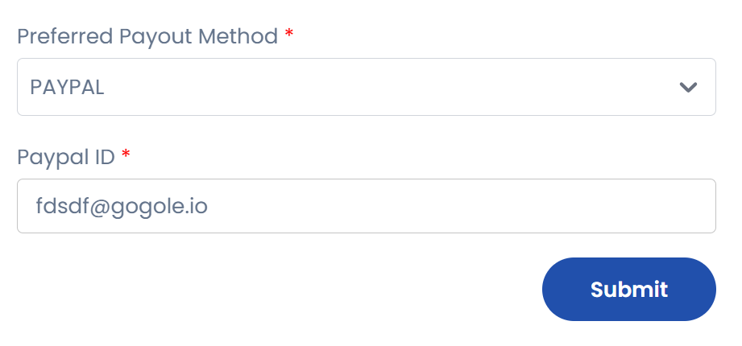

# Payouts

This tab manages the process of paying affiliates their earned commissions. Once a commission is approved, it appears here as part of a payout. Admins can see the total amount due to each affiliate, track payment status Paid and Pending.

- From left-hand side of the page click on **Payouts** to view the list of affiliate payouts.
- To change payout settings click on **Payout Settings**.

- Choose the preferred payment method and enter the details. Click on **Submit**.

----------

## Conclusion
The Payouts section provides complete control over affiliate payments, from tracking pending amounts to processing transactions. For any payment-related inquiries, please contact the finance support team through the help center.
