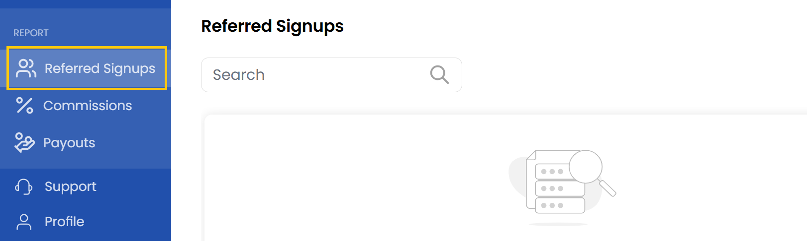

## Referred Signups

This tab displays a list of users who signed up using the affiliate's referral link. Each referred signup would normally include the customer's name, sign-up date, and current status.

- From left-hand side of the page click on **Referred Signups** to view list of users who signed up using the affiliate's referral link  

----------

### Conclusion
The Referred Signups section provides complete visibility into your affiliate-generated registrations, tracking each user from initial signup through conversion. For any discrepancies in referral tracking, contact the affiliate support team.