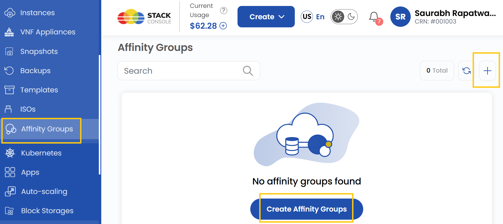
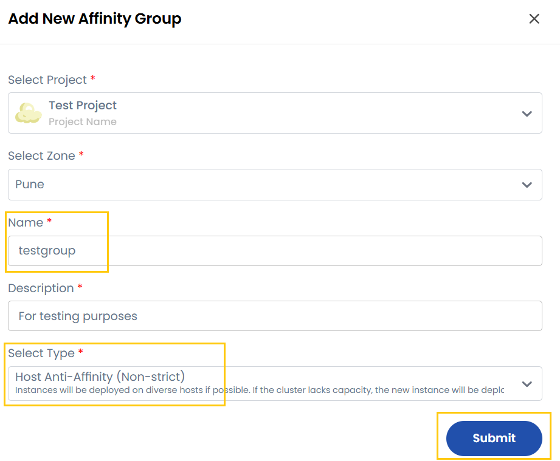

## Affinity Groups

**Affinity Groups** are a way to control the placement of workloads (such as virtual machines, applications, or services) within an infrastructure based on predefined rules. They help optimize performance, ensure high availability, and manage resource allocation efficiently.

In **Stack Console**, Affinity Groups are used to control the placement of virtual machines (VMs) on hypervisor hosts within a cloud infrastructure. They help users define rules that determine whether instances should be placed together on the same host or spread across different hosts.

-----

### Creating an Affinity Group

- From the left-hand side menu, click on the **Affinity Groups** tab.
- To create an affinity group, click the **Create Affinity Groups** or **plus (+)** icon located on the right side of the page. This will open the affinity group creation form.

### Add Affinity Group

- To create a new affinity group, choose the project and select the appropriate availability zone.
- Enter a unique name for the **Affinity Group** and add a brief description to help identify its purpose.
- Select the affinity group type from the following options based on your deployment needs:

  - **Host Affinity (Strict)**: Ensures that a specified set of instances must always run on the same hypervisor host. Ideal for workloads that require low-latency communication and shared resources. If the requirement cannot be met, the instances will not be deployed.

  - **Host Anti-Affinity (Strict)**: Ensures that instances must always be deployed on different hypervisor hosts. This helps improve fault tolerance by preventing a single point of failure. If there are no separate hosts available, instances will not be deployed.

  - **Host Anti-Affinity (Non-Strict)**: Prefers deploying instances on different hypervisor hosts, but this is not strictly enforced. If the cluster lacks capacity, new instances may be deployed on the same hypervisor host as existing ones.

  - **Host Affinity (Non-Strict)**: Prefers deploying instances on the same hypervisor host, but will deploy them elsewhere if needed. If the primary host lacks capacity, new instances will be placed on an available hypervisor host.

- Once done, click on **Submit** and your affinity group will be created.

### Conclusion

By following this guide, you can easily create and manage Affinity Groups on Stack Console. Affinity Groups provide a powerful way to control the placement of virtual machines, ensuring optimal performance, high availability, and efficient resource allocation. For further assistance, refer to the Stack Console documentation or reach out to support.
