## Auto-scaling

**Auto-scaling** is a cloud computing feature that automatically adjusts the number of virtual machine (VM) instances in response to real-time demand. It ensures that your applications remain available and perform optimally while minimizing costs by scaling resources up or down based on usage.

--------

### Creating Auto-scaling

- From the left-hand side menu, click on the **Auto-scaling** tab.
- To create a auto-scaling, click the **Auto-scaling** or **Create New** icon located on the right side of the page. This will open the auto-scaling creation menu.

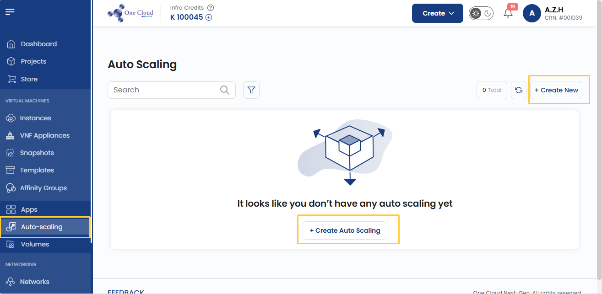

### Assign to a Project

- Assign the load balancer to one of your projects to organize and manage resources effectively.

### Choose a Location

- Select the data center location where your server will be physically hosted.
- Choose from the available locations listed.

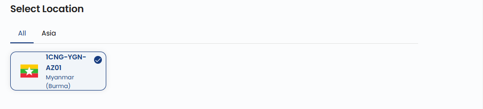

### Choose Network

- Set up or choose a network for your server. This can be an isolated private network, or you can create an elastic network to connect multiple regions.
- Alternatively, you can also create or set up a new network by selecting **Create New Network**.

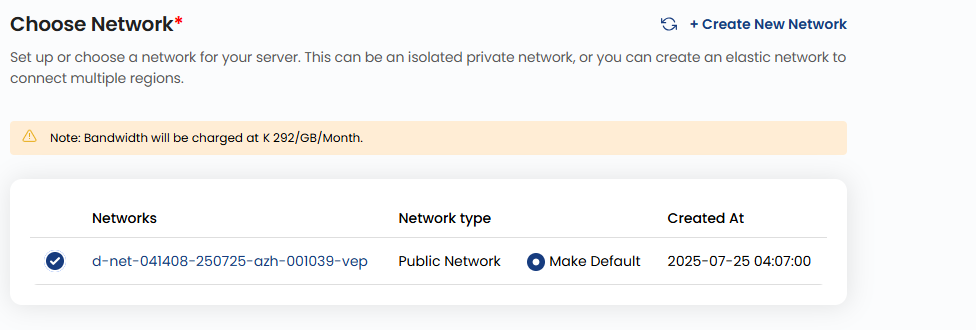

### Select Load Balancer

- A load balancer distributes incoming traffic across multiple VM instances. Select the **Load Balancer** you want from the available list.

### Set Forwarding Rules

- Configure forwarding rules to define how traffic should be distributed across your servers.
- Provide a the port range for incoming traffic with **Public** and **Private** ports.

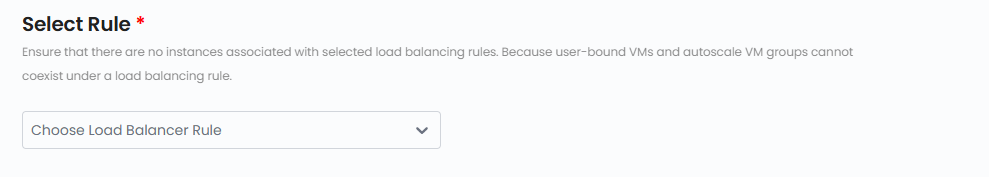

### Choose Image

- Select an operating system or application template to install on your server.

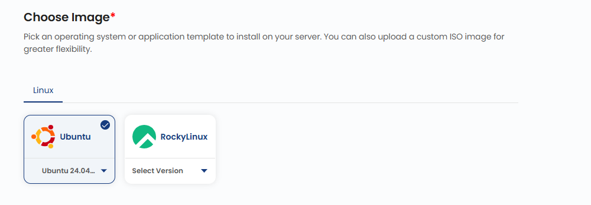

### Choose Plan

- Choose a plan based on your requirements like CPU, memory, storage, and bandwidth. You can also create a custom plan if needed.
- The cost will adjust according to the resources you select.

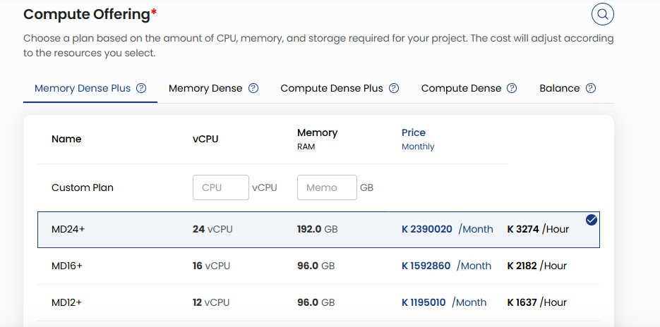

### Server Settings

- In server settings, you can add password to your server to enhance security. Click on **Set now**.
- Enter **Username** and **Password** then clcik on **Confirm** to add password. 

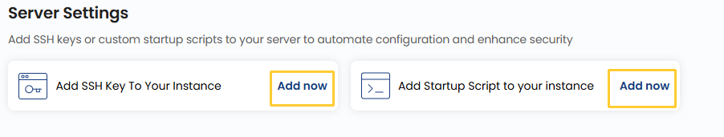

### Capacity Planner

- Enter the minimum and maximum number of instances and enter the grace period in seconds. 

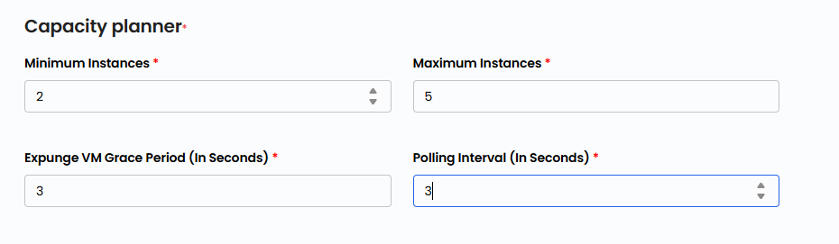

### Set Up Policies

- A **Scale Up** policy is triggered when resource usage exceeds a defined threshold, adding more instances to handle increased demand.

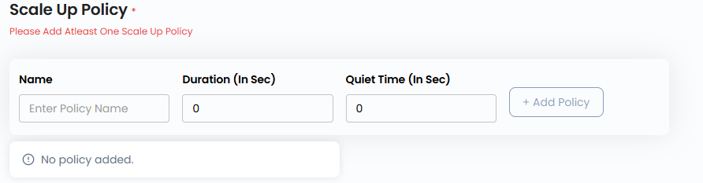

- A **Scale Down** policy is triggered when resource demand drops, reducing the number of active instances to save costs.

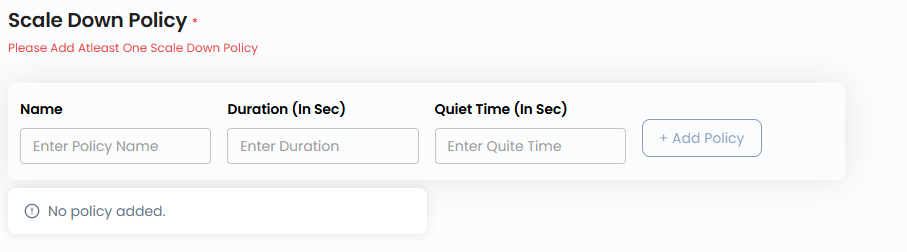

- Click on **Expression** to add expression to your Scale up and Scale down policies. Provide the **Counter**, **Operator** and **Threshold** and click on **Submit**. 

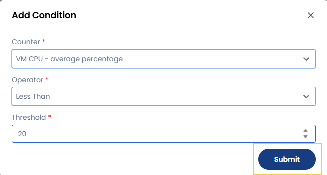

### Choose Auto-scaling Name

- Provide a unique **Auto-scaling Name** for your Auto-scaling to identify it easily in your dashboard.

### Create Auto-scaling

- Choose the desired **Billing Cycle** for your Auto-scaling. Autoscaling supports Monthly, Quarterly, Semiannually, Yearly, Bi-annually, and Tri-annually billing cycles. 
- The billing rules include Date to Date, Fixed Calendar Month, Unfixed Calendar Month, Fixed Prorata, and Unfixed Prorata.
- There is no specific package detail provided, but autoscaling follows the same billing model as other scalable services to adapt to workload demands.
- Verify all the configuration details and review the price summary. Click on **Create** to create the Auto-scaling.

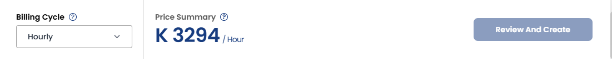

### Conclusion

Auto-scaling is a powerful feature that helps you maintain application performance, availability, and cost efficiency by automatically adjusting resources based on demand. By carefully configuring networks, load balancers, server settings, and scaling policies, you can ensure that your workloads adapt seamlessly to varying traffic patterns.