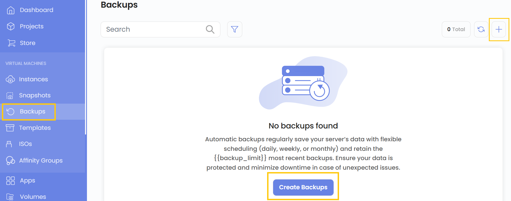
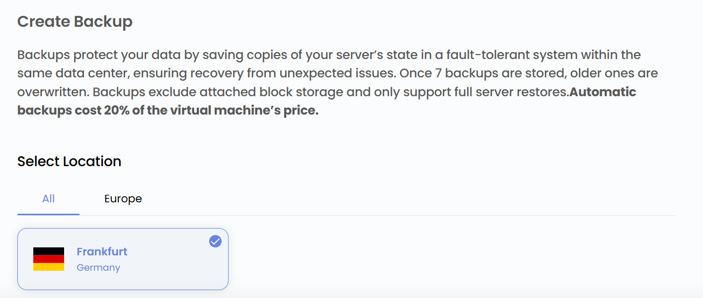
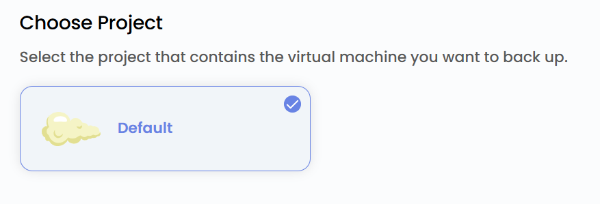
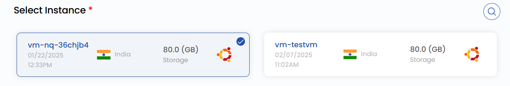
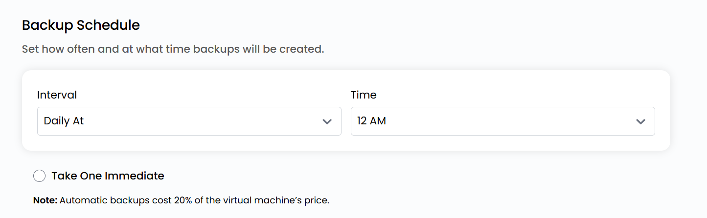

## Backups

**Backups** create copies of your instance’s data to protect against accidental deletions, software failures, or security threats. By enabling backups, you ensure that a restorable version of your VM is always available if needed.

**Stack Console** provides automated backup options on a daily, weekly, or custom schedule, allowing for seamless data recovery without manual intervention. Implementing backups is crucial for safeguarding your data and reducing downtime in case of unexpected issues.

----------

### Creating Backup of an Instance

- From the left-hand side menu, click on the **Backups** tab.
- To create backups, click the **Create Backups** or **plus (+)** icon located on the right side of the page. This will open the backups creation menu.

### Choose a Location

- Select the data center location where your server will be physically hosted.
- Choose from the available locations listed.

### Assign to a Project

- Select the project that contains the virtual machine you want to back up.

### Choose Instance

- From the **Instances** list, select the virtual machine instance for which you want to create a backup.

### Schedule a Backup

- Set how often you want to back up by configuring intervals and specifying the time backups should be created.

:::note
Automatic backups cost 20% of the virtual machine’s price.
:::

- If you want to take a backup immediately while creating the schedule, select the **Take One Immediate** button.

### Create Backup

- Choose the desired **Billing Cycle** for your backup. Snapshots and backups support only Hourly billing cycles. The only billing rule supported is Fixed Prorata.
- Only one package per zone is supported for VM Snapshot, BS Snapshot, and VM Backup. Automatic VM backups cost 20% of the virtual machine price if enabled from the admin.
- Verify all the configuration details and review the price summary. Click on **Create Backup** to create the backup of the virtual machine instance.

### Conclusion

By following this guide, you can easily create and manage backups on Stack Console. Backups provide a reliable way to protect your data, ensuring quick recovery in case of accidental deletions, software failures, or security threats. For further assistance, refer to the Stack Console documentation or reach out to support.
