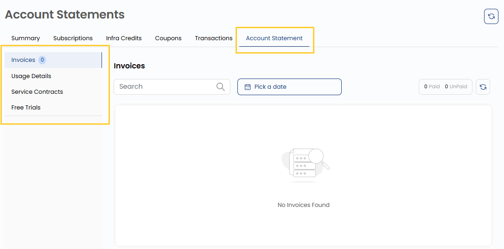

## Account Statement

The **Account Statement** tab provides a financial document that offers a comprehensive summary of all transactions, payments, and usage details associated with an account over a specific period. It serves as a record of account activity, helping users track expenses, verify charges, and maintain transparency in billing.

- **Invoices**: Represent billing documents for services used.
- **Usage Details**: Provide a breakdown of resource consumption.
- **Free Trials**: Indicate trial-based services that may convert into paid subscriptions.

